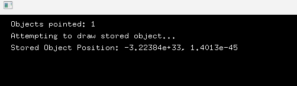

# INVESTIGACIÓN

## ACTIVIDAD 1

### ¿Cuál es el resultado que se obtiene al ejecutar este programa?

```c++
#include "ofApp.h"

//--------------------------------------------------------------
void ofApp::setup(){
    ofBackground(0);
}

//--------------------------------------------------------------
void ofApp::update(){

}

//--------------------------------------------------------------
void ofApp::draw(){
    ofSetColor(255);
    ofDrawCircle(ofGetMouseX(), ofGetMouseY(), 20);
}
```

El resultado que se obtiene al ejecutar este programa, es un circulo que sigue el cursor a donde nosotros lo movamos.

<video controls src=" 2025-08-14 09-00-42.mp4" title="Title"></video>

## ACTIVIDAD 2

### OFAPP.h
```c++
#pragma once

#include "ofMain.h"

class ofApp : public ofBaseApp{

    public:
        void setup();
        void update();
        void draw();

        void mouseMoved(int x, int y );
        void mousePressed(int x, int y, int button);

    private:

        vector<ofVec2f> particles;
        ofColor particleColor;

};

```

## OFAPP.cpp
```c++
#include "ofApp.h"

//--------------------------------------------------------------
void ofApp::setup(){
    ofBackground(0);
    particleColor = ofColor::white;
}

//--------------------------------------------------------------
void ofApp::update(){

}

//--------------------------------------------------------------
void ofApp::draw(){
    for(auto &pos: particles){
        ofSetColor(particleColor);
        ofDrawCircle(pos.x, pos.y, 50);
    }
}

//--------------------------------------------------------------
void ofApp::mouseMoved(int x, int y ){
    particles.push_back(ofVec2f(x, y));
    if (particles.size() > 100) {
        particles.erase(particles.begin());
    }
}

//--------------------------------------------------------------
void ofApp::mousePressed(int x, int y, int button){
    particleColor = ofColor(ofRandom(255), ofRandom(255), ofRandom(255));
}
```

###  ¿Qué fue lo que incluimos en el archivo .h?
En el archivo.h aparte de declarar las funciones principales del codigo de offApp.cpp (setup, update, draw) también declaramos dos eventos que necesita el mouse para que este codigo funcione.

Aparte de esto, también implementamos dos variables adicionales como el vector que guarda las posiciones de las particulas y el ofColor particleColor que sera el color actual que se usara para dibujar las particulas.

### ¿Cómo funciona la aplicación?
Esta aplicación funciona muy similar a la anterior, genera un circulo que esta vez en vez de ser uno solo, cada vez que muevo el mouse se generan mas circulos que siguen el cursor como si fuera una especie de snake, ahora esto tiene un limite de 100 particulas, pero cuando dejo el cursor quieto, se deja tanto de dibujar como de borrar estas particulas, solo se dibuja y se borra cuando el cursor esta en movimiento.

Otra función que tiene este codigo es que cuando le damos al click cambia de color cambia el color con el que se dibujan las particulas.

### ¿Qué hace la función mouseMoved?
Esto hace que cada vez que movamos el mouse, se guarde una posición (x,y) dentro del vector que esta en offApp.h, tambien detecta que no se pase del limite de 100 particulas, osea, borra la particula mas antigua que se haya generado en ese momento para dibujar otra.

El efecto que tiene esto es que las particulas sigan el cursor, generando como si fuera una estela o cuerpo.

### ¿Qué hace la función mousePressed?
Esta lo que hace es que cada vez que le doy al click, cambia de color las particulas, esto lo hace de manera aleatoria y no hay como un orden de que color te pueda salir.

### ¿Qué hace la función setup?
Establece el fondo en negro y inicializa el color de las particulas en blanco.

### ¿Qué hace la función update?
Este se usa para actualizar las variables o la logica de la app antes de dibujar.

### ¿Qué hace la función draw?
Esta recorre todas las posiciones guardadas en particles. y dibuja un circulo en cada una de ellas.

<video controls src=" 2025-08-14 09-18-47.mp4" title="Title"></video>

## ACTIVIDAD 3

### ¿Qué hace cada función y cada linea de código?

#### OFAPP.h

la parte inicial del OFapp.h es basicamente la declaración de la clase principal que hereda de ofBaseapp, prevenir que el archivo se incluya mas de una vez en la compilación y tambien incluye el encabezado por defecto de openframeworks para usar clases como ofColor.

De resto aqui va la explicación linea por linea:

##### Metodos públicos

- Llaman una vez al inicio, se usan para hacer una configuración inicial del programa.
```c++
void setup();
void update();
```
- Se llama en cada frame antes de draw(), se usa para la lógica de la actualización.
```c++
void draw();
````
- Se llama en cada frame para dibujar en la pantalla
```c++
void mouseMoved(int x, int y);
```
- Se llama cada vez que el mouse se mueve
```c++
void mousePressed(int x, int y, int button);
```
##### Atributos privados
- Guarda las posiciones de los circulos
```c++
vector<ofVec2f> particles;
```
- Color actual de los circulos
```c++
ofColor particleColor;
```
#### OFAPP.cpp

- Fija el fondo de pantalla a negro e inicializa el color de las particulas como blanco
```cpp
void ofApp::setup()
{
    ofBackground(0);                     
    particleColor = ofColor::white;      
}
```
- Repite por cada posicion en el vector particles, establece el color del dibujo actual y dibuja un circulo de radio 50 en esta posición.
```cpp
void ofApp::draw()
{
    for(auto &pos: particles)
    {                   
        ofSetColor(particleColor);              l 
        ofDrawCircle(pos.x, pos.y, 50);          
    }
}
```
- Agrega la posición del mouse al vector de particulas y elimina la particula mas antigua si hay mas de 100
```cpp
void ofApp::mouseMoved(int x, int y )
{
    particles.push_back(ofVec2f(x, y));           
    if (particles.size() > 100) 
    {
        particles.erase(particles.begin());       
    }
}
```
- Cambia el color de las particulas a un color aleatorio (rgb entre 0 y 255)
```cpp
void ofApp::mousePressed(int x, int y, int button){
    particleColor = ofColor(ofRandom(255), ofRandom(255), ofRandom(255));
}
```
### Experimento con el codigo modificado
```cpp
#pragma once

#include "ofMain.h"

class ofApp : public ofBaseApp {

public:
    void setup();
    void update();
    void draw();

    void mouseMoved(int x, int y);
    void mousePressed(int x, int y, int button);

private:

    vector<ofVec2f> particles;
    ofColor particleColor;

};
```

```cpp
#include "ofApp.h"

//--------------------------------------------------------------
void ofApp::setup() {
    ofBackground(0);
    particleColor = ofColor::white;
}

//--------------------------------------------------------------
void ofApp::update() {

}

//--------------------------------------------------------------
void ofApp::draw() {
    int total = particles.size();

    for (int i = 0; i < total; ++i) 
    {
        float alpha = ofMap(i, 0, total - 1, 50, 255); 
        float radius = ofMap(i, 0, total - 1, 10, 50); 

        ofSetColor(particleColor.r, particleColor.g, particleColor.b, alpha);
        ofDrawCircle(particles[i].x, particles[i].y, radius);
    }
}

//--------------------------------------------------------------
void ofApp::mouseMoved(int x, int y) {
    particles.push_back(ofVec2f(x, y));
    if (particles.size() > 100) {
        particles.erase(particles.begin());
    }
}

//--------------------------------------------------------------
void ofApp::mousePressed(int x, int y, int button) {
    particleColor = ofColor(ofRandom(255), ofRandom(255), ofRandom(255));
}
```
El cambio que le hice al codigo fue en el draw, para que en vez de que los circulos se vieran estaticos, quize que mientras mas circulos genere, los que estan en la parte trasera vayan disminuyendo. Donde, implemente un ciclo for que se va a ejecutar una vez por particula almacenada, disminuye el tamaño hasta desaparecer.

<video controls src=" 2025-08-19 09-12-24.mp4" title="Title"></video>

## ACTIVIDAD 5

```cpp
#pragma once

#include "ofMain.h"


class Sphere {
public:
    Sphere(float x, float y, float radius);
    void draw();
    void update(float x, float y);
    float getX();
    float getY();
    float getRadius();

private:
    float x, y;
    float radius;
    ofColor color;
};

class ofApp : public ofBaseApp{

    public:
        void setup();
        void update();
        void draw();

        void mouseMoved(int x, int y );
        void mousePressed(int x, int y, int button);

    private:

        vector<Sphere*> spheres;
        Sphere* selectedSphere;
};

```
```cpp
#include "ofApp.h"

Sphere::Sphere(float x, float y, float radius) : x(x), y(y), radius(radius) {
    color = ofColor(ofRandom(255), ofRandom(255), ofRandom(255));
}

void Sphere::draw() {
    ofSetColor(color);
    ofDrawCircle(x, y, radius);
}

void Sphere::update(float x, float y) {
    this->x = x;
    this->y = y;
}

float Sphere::getRadius() {
    return radius;
}

float Sphere::getX() {
    return x;
}

float Sphere::getY() {
    return y;
}

//--------------------------------------------------------------
void ofApp::setup(){
    ofBackground(0);

    for (int i = 0; i < 5; i++) {
        float x = ofRandomWidth();
        float y = ofRandomHeight();
        float radius = ofRandom(20, 50);
        spheres.push_back(new Sphere(x, y, radius));
    }
    selectedSphere = nullptr;

}

//--------------------------------------------------------------
void ofApp::update(){
    if (selectedSphere != nullptr) {
        selectedSphere->update(ofGetMouseX(), ofGetMouseY());
    }
}

//--------------------------------------------------------------
void ofApp::draw(){
    for (auto sphere : spheres) {
        sphere->draw();
    }
}


//--------------------------------------------------------------
void ofApp::mouseMoved(int x, int y ){

}

//--------------------------------------------------------------
void ofApp::mousePressed(int x, int y, int button){

    if(button == OF_MOUSE_BUTTON_LEFT){
        for (auto sphere : spheres) {
            float distance = ofDist(x, y, sphere->getX(), sphere->getY());
            if (distance < sphere->getRadius()) {

                selectedSphere = sphere;
                break;
            }
        }
    }
}
```
#### ¿Cuál es la definición de un puntero?
El puntero es una variable que almacena la dirección de memoria de otra variable, en vez de contener directamente un valor, esta contiene la ubicación donde se encuentra este valor. En el caso de este código serian el x, y, Radius de las esferas.

#### ¿Dónde está el puntero?
El puntero mas relevante esta en el OFAPP.h 
```cpp
vector<Sphere*> spheres;
Sphere* selectedSphere;
```
Los cuales son atributos privados y estos mismos son los que se encargan de almacenar los punteros de las cinco esferas que se ven a generar, y en el otro codigo se llamaran para poder usarlos en la selección de la esfera con el MOUSEPRESSED.

#### ¿Cómo se inicializa el puntero?
Los punteros se inicializan en el setup(), donde se crean dinamicamente objetos de tipo sphere y almacenar las direcciones en el vector spheres. aunque tambien esta la parte del nullptr, el cual se encarga de que al iniciar el codigo no se seleccione ningun puntero para poder seleccionarlo al dar click.

#### ¿Para qué se está usando el puntero?
Los punteros (sphere*) se usan para manejar dinamicamente objetos de la clase sphere, es decir, se crean las spheres en el setup y se guardan en el vector. El puntero en vez de guardar copias completas de las esferas, guarda las direcciones a los datos de esta (x, y, radius). Mientras que el puntero selectedSphere sirve para referenciar una esfera cuando le damos clic.

#### ¿Qué es exactamente lo que está almacenado en el puntero?
La dirección de memoria de cada una de las esferas que se generan (x, y, radius), mientras que el selected sphere apunta a uno de estos mismos objetos.

## ACTIVIDAD 6

<video controls src=" 2025-08-21 08-10-31.mp4" title="Title"></video>

 El error es que cuando yo selecciono una esfera, no puedo soltarla de una en cualquier parte. Tengo que buscar una esfera mas grande para poder cambiar la selección de la esfera. Esto se debe a que los punteros guardan la información de las esferas que ya fueron generadas, y por el vector spehereSelected que es quiem permite la selección de las esferas en base a sus datos.

Decidi, agregarle un mouseReleased para poder corregir este problema, cuando suelte el clic, la esfera se deja de seleccionar y queda a donde la llevaste con el mouse. Aparte tuve que hacerle el siguiente atributo para que funcionara lo de agarrar la esfera y soltarlo cuando sea:

```c++

    // En OFAPP.h
    void mouseReleased(int x, int y, int button);

    // ATRIBUTO BOOL PARA PODER QUE FUNCIONE :/
    bool estaAgarrando = false;

    void ofApp::mouseReleased(int x, int y, int button) 
    
    if (button == OF_MOUSE_BUTTON_LEFT) {
        estaAgarrando = false;
        selectedSphere = nullptr;
    }
```

CODIGOS CORREGIDOS COMPLETOS

OFAPP.h

```c++
#pragma once

#include "ofMain.h"


class Sphere {
public:
    Sphere(float x, float y, float radius);
    void draw();
    void update(float x, float y);
    float getX();
    float getY();
    float getRadius();

private:
    float x, y;
    float radius;
    ofColor color;
};

class ofApp : public ofBaseApp {

public:
    void setup();
    void update();
    void draw();

    void mouseMoved(int x, int y);
    void mousePressed(int x, int y, int button);
    void mouseReleased(int x, int y, int button);

private:

    vector<Sphere*> spheres;
    Sphere* selectedSphere;
};
```

OFAPP.cpp
```c++
#include "ofApp.h"

Sphere::Sphere(float x, float y, float radius) : x(x), y(y), radius(radius) {
    color = ofColor(ofRandom(255), ofRandom(255), ofRandom(255));
}

bool estaAgarrando = false;

void Sphere::draw() {
    ofSetColor(color);
    ofDrawCircle(x, y, radius);
}

void Sphere::update(float x, float y) {
    this->x = x;
    this->y = y;
}

float Sphere::getRadius() {
    return radius;
}

float Sphere::getX() {
    return x;
}

float Sphere::getY() {
    return y;
}

//--------------------------------------------------------------
void ofApp::setup() {
    ofBackground(0);

    for (int i = 0; i < 5; i++) {
        float x = ofRandomWidth();
        float y = ofRandomHeight();
        float radius = ofRandom(20, 50);
        spheres.push_back(new Sphere(x, y, radius));
    }
    selectedSphere = nullptr;

}

//--------------------------------------------------------------
void ofApp::update() {
    if (estaAgarrando && selectedSphere != nullptr) {
        selectedSphere->update(ofGetMouseX(), ofGetMouseY());
    }
}


//--------------------------------------------------------------
void ofApp::draw() {
    for (auto sphere : spheres) {
        sphere->draw();
    }
}


//--------------------------------------------------------------
void ofApp::mouseMoved(int x, int y) {

}

//--------------------------------------------------------------
void ofApp::mousePressed(int x, int y, int button) {
    if (button == OF_MOUSE_BUTTON_LEFT) {
        for (auto sphere : spheres) {
            float distance = ofDist(x, y, sphere->getX(), sphere->getY());
            if (distance < sphere->getRadius()) {
                selectedSphere = sphere;
                estaAgarrando = true;
                return;
            }
        }
        selectedSphere = nullptr;
        estaAgarrando = false;
    }

    
}

void ofApp::mouseReleased(int x, int y, int button) {
    if (button == OF_MOUSE_BUTTON_LEFT) {
        estaAgarrando = false;
        selectedSphere = nullptr;
    }
}
```
Prueba de que funciona:

<video controls src=" 2025-08-21 08-30-12.mp4" title="Title"></video>

## ACTIVIDAD 7

OFAPP.h
```c++
#pragma once

#include "ofMain.h"

class Sphere {
public:
    Sphere(float x, float y, float radius);
    void draw() const;

    float x, y;
    float radius;
    ofColor color;
};

class ofApp : public ofBaseApp {
public:
    void setup();
    void update();
    void draw();

    void keyPressed(int key);

private:
    std::vector<Sphere*> globalVector;
    void createObjectInStack();
};
```
OFAPP.cpp
```c++
#include "ofApp.h"

Sphere::Sphere(float x, float y, float radius) : x(x), y(y), radius(radius) {
    color = ofColor(ofRandom(255), ofRandom(255), ofRandom(255));
}

void Sphere::draw() const {
    ofSetColor(color);
    ofDrawCircle(x, y, radius);
}

void ofApp::setup() {
    ofBackground(0);
}

void ofApp::update() {
}

void ofApp::draw() {
    ofSetColor(255);
    for (Sphere* sphere : globalVector) {
        if (sphere != nullptr) {
            ofDrawBitmapString("Objects pointed: " + ofToString(globalVector.size()), 20, 20);
            ofDrawBitmapString("Attempting to draw stored object...", 20, 40);
            ofDrawBitmapString("Stored Object Position: " + ofToString(sphere->x) + ", " + ofToString(sphere->y), 20, 60);
            sphere->draw();
        }
    }
}

void ofApp::keyPressed(int key) {
    if (key == 'c') {
        if (globalVector.empty()) {
            createObjectInStack();
        }
    }
    else if (key == 'd') {
        if (!globalVector.empty()) {
            ofLog() << "Accessing object in global vector: Position (" << globalVector[0]->x << ", " << globalVector[0]->y << ")";
        }
        else {
            ofLog() << "No objects in the global vector.";
        }
    }
}

void ofApp::createObjectInStack() {
    Sphere localSphere(ofRandomWidth(), ofRandomHeight(), 30);
    globalVector.push_back(&localSphere);
    ofLog() << "Object created in stack: Position (" << localSphere.x << ", " << localSphere.y << ")";
    localSphere.draw();
}
```
### ¿Qué sucede cuando presionas la tecla “c”?



Cuando presiono la tecla C, se ejecuta el metodo createObjectInStack(), que crea un objeto sphere en el stack llamado localSPhere, agrega la direccion a globalVector y guarda un puntero, dibuja el objeto y luego termina la función. Lo que pasa es que cuando presionamos la tecla C, Este mismo objeto se crea y se elimina, ya que esta creado en la pila stack y no en heap, sin embargo, el puntero guardo la información global de este objeto asi este destruido, por lo que aparecen esas posiciones tan extrañas al ejecutar y presionar la C.

### CORRECIÓN DEL CODIGO

```c++
void ofApp::createObjectInStack() {
    // Sphere localSphere(ofRandomWidth(), ofRandomHeight(), 30);
    // globalVector.push_back(&localSphere);
    // ofLog() << "Object created in stack: Position (" << localSphere.x << ", " << localSphere.y << ")";
    // localSphere.draw();
    Sphere* heapSphere = new Sphere(ofRandomWidth(), ofRandomHeight(), 30);
    globalVector.push_back(heapSphere);
    ofLog() << "Object created in heap: Position (" << heapSphere->x << ", " << heapSphere->y << ")";
    heapSphere->draw();
}
```

### ¿Qué sucede cuando presionas la tecla “c”?


Basicamente lo mismo que con el anterior, pero con la gran diferencia de que al usar el heap en vez del stack, si se dibuja el objeto, si se guarda el puntero en globalVector con una dirección normal y el objeto no se elimina, sigue existiendo.

### ¿Por qué ocurre esto?

Porque ahora estamos usando el heap, una asignación dinamica de memoria. Esto hace que cuando creamos el objeto no se destruya al salir de la función, sino que quede de alguna manera "vivo" en el heap y el puntero guarda la dirección de la esfera que no fue eliminada.

## ACTIVIDAD 8
Construye un experimento (un programa) en el que puedas crear y dibujar objetos que se almacenan:

- En el `heap`.
- En el `stack`.
- En memoria global.

### OFAPP.H

```cpp
#pragma once
#include "ofMain.h"

class Sphere {
public:
    Sphere(float x = 0, float y = 0, float radius = 10);

    void draw() const;
    void setPosition(float x, float y);
    bool contains(int px, int py) const;

    void setColor(const ofColor& c);

    float getX() const { return x; }
    float getY() const { return y; }
    float getRadius() const { return radius; }

private:
    float x, y;
    float radius;
    ofColor color;
};

extern Sphere globalSphere;

class ofApp : public ofBaseApp {
public:
    void setup() override;
    void update() override;
    void draw() override;

    void mousePressed(int x, int y, int button) override;
    void mouseDragged(int x, int y, int button) override;
    void mouseReleased(int x, int y, int button) override;

    ~ofApp(); 

private:
    std::vector<Sphere*> heapSpheres;
    
    Sphere stackSphere;
    Sphere* selected = nullptr;
    bool dragging = false;
};
```
### OFAPP.CPP

```cpp
#include "ofApp.h"

Sphere globalSphere(100, 100, 40);

Sphere::Sphere(float x, float y, float radius)
    : x(x), y(y), radius(radius), color(ofColor::white) {}

void Sphere::draw() const {
    ofSetColor(color);
    ofDrawCircle(x, y, radius);
}

void Sphere::setPosition(float nx, float ny) {
    x = nx; y = ny;
}

bool Sphere::contains(int px, int py) const {
    return ofDist(px, py, x, y) <= radius;
}

void Sphere::setColor(const ofColor& c) { color = c; }

void ofApp::setup() {
    ofBackground(0);
    ofSetCircleResolution(64);

    heapSpheres.push_back(new Sphere(200, 200, 30));
    heapSpheres.push_back(new Sphere(300, 200, 30));
    heapSpheres.push_back(new Sphere(200, 300, 30));
    for (auto* s : heapSpheres) s->setColor(ofColor::blue);

    stackSphere = Sphere(420, 300, 55);
    stackSphere.setColor(ofColor::green);

    globalSphere.setColor(ofColor::red);

    selected = nullptr;
    dragging = false;
}

void ofApp::update() {
    
}

void ofApp::draw() {
    for (auto* s : heapSpheres) s->draw(); 
    stackSphere.draw();                     
    globalSphere.draw();                    

    ofSetColor(255);
    ofDrawBitmapString("Heap: Esferas azules", 20, 20);
    ofDrawBitmapString("Stack: Esfera verde (centro-derecha)", 20, 40);
    ofDrawBitmapString("Global: Esfera roja (arriba-izq)", 20, 60);
}

void ofApp::mousePressed(int x, int y, int button) {
    if (button != OF_MOUSE_BUTTON_LEFT) return;

    for (auto* s : heapSpheres) {
        if (s->contains(x, y)) { selected = s; dragging = true; return; }
    }
    if (stackSphere.contains(x, y)) { selected = &stackSphere; dragging = true; return; }
    if (globalSphere.contains(x, y)) { selected = &globalSphere; dragging = true; return; }

    selected = nullptr;
    dragging = false;
}

void ofApp::mouseDragged(int x, int y, int button) {
    if (dragging && selected) selected->setPosition(x, y);
}

void ofApp::mouseReleased(int x, int y, int button) {
    if (button != OF_MOUSE_BUTTON_LEFT) return;
    dragging = false;
    selected = nullptr;
}

ofApp::~ofApp() {
    for (auto* s : heapSpheres) delete s;
    heapSpheres.clear();
}
```
### RESULTADO DE EJECUTARLO


- En el heap se crean las esferas azules
- En el stack la verde (no se borra hasta que se aplique el delete)
- en el global la roja

### ¿Cuándo debo crear objetos en el heap y cuándo en memoria global?

Debemos crear objetos en memoria GLOBAL cuando estos mismos objetos se usen en todo el programa, es decir, los objetos de esta memoria permancen si o si cuando el programa se ejecuta, en cambio. La memoria heap se usa para crear objetos en una clase o función, que se crea con new y se borra con delete, es decir, la vida de este objeto depende de nosotros. Mejor dicho, para la memoria global se podrian crear objetos constantes durante toda la ejecución del programa, mientras que el heap, se usa para algunas clases o funciones, donde se crean y se borran dependiendo del tiempo que queramos usar

## ACTIVIDAD 9

### ¿Qué sucede cuando presionas la tecla “f”?

Cuando doy click, se genera un circulo que aparece donde tengo el cursor, mas o menos asi:


Ahora cuando presiono la tecla "f", esta borra el circulo mas reciente, para hacer la carita feliz lo primero que dibuje fueron los ojos, por ende si le doy seis veces a la "f", la sonrisa va a desaparecer, quedando asi: 


En resumen, cuando se presiona la tecla f esta ejecuta una acción que elimina el circulo mas reciente.

###     Analiza detalladamente esta parte del código:

```cpp
if(!heapObjects.empty()) {
    delete heapObjects.back();
    heapObjects.pop_back();
}
```
Basicamente, el if verifica que el vector no este vacio, pero si este mismo contiene un puntero guardado, lo elimina para liberar memoria y termina con quitar el puntero del vector, para eso sirven esas tres lineas de codigo.


