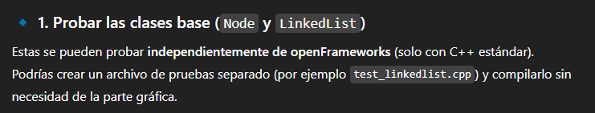
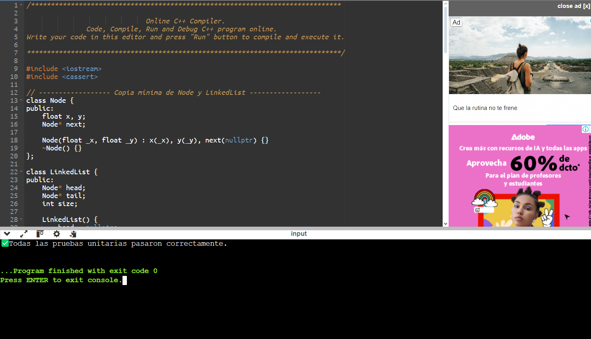
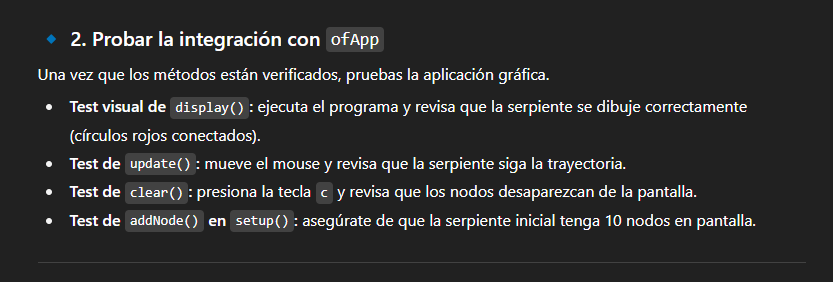

# INVESTIGACIÓN

# ACTIVIDAD 1

## ofApp.h

```cpp
#pragma once
#include "ofMain.h"

class Node {
public:
	float x, y;
	Node* next;

	Node(float _x, float _y);
	~Node();
};

class LinkedList {
public:
	Node* head;
	Node* tail;
	int size;

	LinkedList();
	~LinkedList();

	void clear();
	void addNode(float x, float y);
	void update(float x, float y);
	void display();
};

class ofApp : public ofBaseApp {
public:
	LinkedList snake;
	void setup();
	void update();
	void draw();
	void keyPressed(int key); // Nueva función para manejar el teclado
};
```

## oFApp.cpp

```cpp
#include "ofApp.h"

//--------------------------------------------------------------
void ofApp::setup() {
	// Agregar nodos a la serpiente
	ofBackground(255, 255, 255);
	for (int i = 0; i < 10; i++) {
		snake.addNode(ofGetWidth() / 2, ofGetHeight() / 2);
	}
}
//--------------------------------------------------------------
void ofApp::update() {
	// Actualizar la posición de la serpiente
	snake.update(ofGetMouseX(), ofGetMouseY());
}
//--------------------------------------------------------------
void ofApp::draw() {
	ofBackground(220);
	// Dibujar la serpiente
	snake.display();
}
//--------------------------------------------------------------
void ofApp::keyPressed(int key) {
	if (key == 'c') {
		snake.clear(); // Limpiar la lista cuando se presiona la tecla 'c'
	}
}
//--------------------------------------------------------------

LinkedList::LinkedList() {
	head = new Node(ofGetWidth() / 2, ofGetHeight() / 2);
	tail = head;
	size = 1;
}
//--------------------------------------------------------------
LinkedList::~LinkedList() {
	clear();
}
//--------------------------------------------------------------
void LinkedList::clear() {
	Node* current = head;
	while (current != nullptr) {
		Node* nextNode = current->next;
		delete current;
		current = nextNode;
	}
	head = nullptr;
	tail = nullptr;
	size = 0;
}
//--------------------------------------------------------------
void LinkedList::addNode(float x, float y) {
	Node* newNode = new Node(x, y);
	if (tail != nullptr) {
		tail->next = newNode;
		tail = newNode;
	}
	else {
		head = tail = newNode;
	}
	size++;
}
//--------------------------------------------------------------
void LinkedList::update(float x, float y) {
	Node* current = head;
	float prevX = x;
	float prevY = y;

	while (current != nullptr) {
		float tempX = current->x;
		float tempY = current->y;
		current->x = prevX;
		current->y = prevY;
		prevX = tempX;
		prevY = tempY;
		current = current->next;
	}
}
//--------------------------------------------------------------
void LinkedList::display() {
	Node* current = head;
	while (current != nullptr) {
		ofSetColor(ofColor(255, 0, 0));
		ofDrawCircle(current->x, current->y, 10);
		current = current->next;
	}
}
//--------------------------------------------------------------
Node::Node(float _x, float _y) {
	x = _x;
	y = _y;
	next = nullptr;
}
//--------------------------------------------------------------
Node::~Node() {
	// Destructor para Node
}

```

### ¿Qué es una lista enlazada y en qué se diferencia de un arreglo en cuanto a la forma en que los elementos están almacenados en la memoria?

Una lista enlazada es una estructura compuesta por una secuencia de nodos, donde cada uno de estos tiene un valor y un puntero al siguiente nodo en la secuencia. Esto sirve para almacenar elementos de manera no consecutiva en la memoria. Ahora, ¿Que lo diferencia de un arreglo?. La forma en la que almacenan los datos en la memoria, mientras que la lista enlazada necesita de punteros debido a que todo esta disperso; en el arreglo, todo esta almacenado de forma consecutiva.

### Al observar el código de una lista enlazada en C++, ¿Cómo crees que se vinculan los nodos entre sí? ¿Qué estructura se utiliza para lograr esta conexión?

Mediante los punteros, ya que cada nodo tiene un puntero llamado next, que apunta al siguiente nodo en la lista, Mientras que el inicial solo esta referenciado en head, y el final apunta a nullptr, para que no siga la ejecución de este.

Ahora la estructura en este codigo que se utiliza para todo esto de los nodos es la del puntero node* next que esta dentro de la clase node, mejor dicho este fragmento:

```cpp
class Node {
public:
    float x, y;
    Node* next;  // Este puntero conecta el nodo con el siguiente nodo en la lista
    Node(float _x, float _y);
    ~Node();
};
```
Esto permite que los nodos se "encadenen" de una forma dinamica en la memoria, sin necesidad de que esten almacenadas consecutivamente.

### ¿Cómo se gestiona la memoria en una lista enlazada? Investiga cómo se crea y se destruye un nodo en memoria utilizando el operador new y delete en C++.

La memoria en una lista enlazada se gestiona manualmente con el opreador NEW para crear nodos dinamicamente en el heap y el operador DELETE liberar esa memoria cuando los nodos ya no son necesarios. Cada vez que se agrega un nodo, se utiliza el new para asignar la memoria y el delete para evitar fugas.

### Considerando la estructura de una lista enlazada, ¿qué ventajas ofrece en comparación con un arreglo cuando se trata de insertar o eliminar elementos en posiciones intermedias?

Una lista enlazada permite insertar o eliminar elementoss en posiciones intermedias de una manera mas eficiente que un arreglo, ya que este mismo no requiere mover el resto de los elementos, solo necesita los punteros de los nodos que tienen un costo mas constante que los arreglos

### En el código presentado, ¿Cómo se asegura que no haya fugas de memoria? ¿Qué papel juega el destructor en la clase LinkedList?

Con el metodo Clear(), este recorre la lista enlazada y libera la memoria de cada nodo usando delete. El LinkedList llama a este metodo automaticamente cuando un objeto del mismo tipo de esta clase es destruido, Así, el destructor garantiza que toda la memoria dinámica utilizada por los nodos se libere correctamente cuando la lista deje de existir, evitando pérdidas de memoria

```cpp
LinkedList::~LinkedList() {
    clear();  // Libera todos los nodos al destruir la lista
}
-------------------------------

void LinkedList::clear() {
    Node* current = head;
    while (current != nullptr) {
        Node* nextNode = current->next;
        delete current;        // Libera la memoria del nodo actual
        current = nextNode;    // Avanza al siguiente nodo
    }
    head = nullptr;
    tail = nullptr;
    size = 0;
}

```
### ¿Qué sucede en la memoria cuando se invoca el método clear() en una lista enlazada? Explica paso a paso cómo se liberan los recursos.

Proceso del medtodo clear en la LinkedList:

- Se crea un puntero temporal current que apunta al primer nodo  de la lista.

- Mientras current no sea nullptr, este mismo guarda en otro puntero nextNode la dirección del siguiente nodo, llama a delete current, Invoca el destructor del nodo actual, Libera la memoria dinámica ocupada por ese nodo en el heap, Se actualiza current para que apunte al nodo siguiente.

- Cuando current llega a nullptr, significa que todos los nodos han sido liberados.

- Se actualizan los punteros head y tail a nullptr, y el tamaño size a 0, indicando que la lista está vacía.

### Explica cómo cambia la estructura en memoria de una lista enlazada al agregar un nuevo nodo al final de la lista. ¿Cómo afecta esto al rendimiento de la lista enlazada?

Al agregar un nodo al final de la lista, se crea de manera dinamica en la memoria un nuevo nodo y el puntero del nodo final se actualiza para apuntar al nodo recien creado, manteniendo la conexion de la lista. Esto permite que la operacion de insercion se realice a tiempo constante. ya que no es necesario que recorra la lista completa, mejorando asi el rendimiento en comparacion con listas que no mantienen un puntero al ultimo nodo.	
    
=======
Al agregar un nodo al final de la lista, se crea de manera dinamica en la memoria un nuevo nodo y el puntero del nodo final se actualiza para apuntar al nodo recien creado, manteniendo la conexion de la lista. Esto permite que la operacion de insercion se realice a tiempo constante. ya que no es necesario que recorra la lista completa, mejorando asi el rendimiento en comparacion con listas que no mantienen un puntero al ultimo nodo.

### Analiza una situación en la que utilizar una lista enlazada sería más ventajoso que utilizar un arreglo. Justifica tu respuesta considerando la gestión de memoria y las operaciones de inserción y eliminación.

Un caso donde es mas ventajoso usar una lista enlazada en vez de un arreglo, es en un programa donde se realizan muchas inserciones y eliminaciones de posiciones intermedias o al inicio de una estructura de datos, como por ejemplo en un editor de texto que gestiona lineas o caracteres dinamicamente.

Ahora, cuando hablamos por la parte de gestion de memoria, el arreglo requiere de una cantidad de memoria consecutiva que previene fallos como que el mismo se quede sin memoria, lo cual llevaria a una creacion de un arreglo mas grande donde tengamos que copiar y pegar todo lo del arreglo anterior, lo que nos cuesta tiempo y espacio, mientras que con una lista enlazada, a cada nodo se le asigna de manera dinamica memoria no consecutiva, lo que evita problemas como los que comentamos en el arreglo.

En el caso de las inserciones y eliminaciones, el arreglo necesita insertar o eliminar posiciones intermedias que requieren desplazar multiples elementos, lo que tiene un gran costo de tiempo, mientras que con una lista enlazada, basta con que con actualizar los punteros para que sirva de una manera mas eficiente

Como dije anteriormente, esto se puede ver mejor en un pograma de edición de texto, donde constantemente se agregan y eliminan caracteres en medio del documento. Con un arreglo se requiere desplazar gran parte del contenido para cumplir la modificación, mientras que con la lista enlazada al cambiar los nodos, nos permite hacer modificaciones mas rapidas.

### Después de estudiar el manejo de memoria en listas enlazadas, ¿Cómo aplicarías este conocimiento para diseñar una estructura de datos personalizada para una aplicación creativa? ¿Qué aspectos considerarías para asegurar la eficiencia y evitar fugas de memoria?

Como tal, yo priorizaría que fuera mas dinamico, porque al ser una aplicación creativa, lo mas probable es que tenga varios cambios, por lo que es mejor manejarlo de una forma mas dinamica ppara que solo sea actualizar y no tener que desplazar todo un contenido.

En el caso de la gestion de memoria, seria mediante nodos dinamicos para evitar perdidas de espacio, y asi liberar la memoria de los nodos eliminados inmediatamente para evitar fugas de memoria.

Ahora, la estructura de la lista depende bastante de lo que uno quiera hacer como aplicacion creativa, puede ser enlazada, doblemente enlazada o tambien puede tener una lista adicional de nodos para modificar mas cosas, pero como tal, es eso, dependiendo de lo que se quiera hacer, se usan estas listas.

Para tener un acceso eficiente, tener punteros en la cabeza y cola del programa es crucial para las operaciones rapidas de inserción, aunque tambien se podrian usar arrays para acceder rapido a alguna información en especifico que requiera el programa, para compensar, por asi decirlo, el lento acceso secuencial de las listas.

Para prevenir fugas se puede hacer un metodo de limpieza que recorra las listas y libere los nodos antes de que la aplicación termine. La eficiencia tiene que enfocarse en el rendimiento a tiempo real para asi tener un mejor funcionamiento de lo que se quiera hacer.

La clave es liberar memoria correctamente, elegir el tipo de lista adecuado y, si es necesario, combinarla con otras estructuras para mejorar la eficiencia.

### Reflexiona sobre las diferencias en la gestión de memoria entre C++ y un lenguaje con recolección de basura automática como C#. ¿Qué ventajas y desafíos encuentras en la gestión explícita de memoria en C++ al trabajar con estructuras de datos?

Como dice el enunciado, en c++ se gestiona la memoria, mientras que en C# se elimina de manera automatica, por lo que tiene sus ciertas ventajas y desventajas a la hora de usarse.

#### C++

##### VENTAJAS

- Se puede optimizar al maximo el uso de memoria.
- Se sabe cuando un objeto deja de existir ya que el programador es quien define eso
- Posibilidades de estructuras de datos muy especializadas (como las listas enlazadas) que aprpovechan el hardware al limite

##### DESVENTAJAS
- hay un mayor riesgo de errores como por ejemplo las fugas de memoria
- Es mas complejo de usar
- Dificulta bastante usar esto en proyectos grandes, ya que hay que estar pendientes del ciclo de vida de cada recurso

#### C# (GARBAGE COLLECTOR)

##### VENTAJAS

- Mayor seguridad: se reducen fugas de memoria y errores comunes de punteros.

- El desarrollo es más rápido y productivo, porque el programador se concentra en la lógica más que en el manejo de memoria.

- Bueno para aplicaciones donde la prioridad es la robustez y la mantenibilidad.

##### DESVENTAJAS

-  El programador no decide cuándo exactamente se libera la memoria.

- Posibles pausas en tiempo de ejecución (GC pauses), que afectan el rendimiento en aplicaciones en tiempo real.

- Menor flexibilidad para construir estructuras de datos extremadamente optimizadas.

Despues de todo esto, basicamente el C++ es mas util cuando necesitamos maximo rendimiento, mientras con C# se usa para tener un desarrollo mas seguro y rapido.

### Imagina que estás optimizando una pieza de arte generativo que usa listas enlazadas para representar elementos en movimiento. ¿Qué consideraciones tomarías en cuenta para garantizar que la gestión de la memoria sea eficiente y que no ocurran fugas de memoria?

Primero verificaría que la creación y destrucción de nodos este controlada, osea que cada nodo este referenciado para no tener posibles fugas. Despues, me pondria a ver las referencias y la consistencia de la lista, para ver que no haya algun error extraño. Despues implementaria alguna manera de reutilizar memoria, como un object pooling. Para finalizar, depuraría el proyecto para buscar errores que no se referencian

### Pruebas: pregunta a ChatGPT cómo podrías probar las partes del programa y el programa completo. Luego realiza las pruebas y verifica si los resultados coinciden con tus expectativas.

#### Funcionamiento del programa

<video controls src="20250914-0007-38.9578354.mp4" title="Title"></video>

#### PRUEBAS



Me dio un codigo para verificar la funcionalidad de estas clases antes de implementar en OF, asi que me salio esto

```cpp
#include <iostream>
#include <cassert>

// ------------------ Copia mínima de Node y LinkedList ------------------
class Node {
public:
    float x, y;
    Node* next;

    Node(float _x, float _y) : x(_x), y(_y), next(nullptr) {}
    ~Node() {}
};

class LinkedList {
public:
    Node* head;
    Node* tail;
    int size;

    LinkedList() {
        head = nullptr;
        tail = nullptr;
        size = 0;
    }

    ~LinkedList() {
        clear();
    }

    void clear() {
        Node* current = head;
        while (current != nullptr) {
            Node* nextNode = current->next;
            delete current;
            current = nextNode;
        }
        head = nullptr;
        tail = nullptr;
        size = 0;
    }

    void addNode(float x, float y) {
        Node* newNode = new Node(x, y);
        if (tail != nullptr) {
            tail->next = newNode;
            tail = newNode;
        } else {
            head = tail = newNode;
        }
        size++;
    }

    void update(float x, float y) {
        Node* current = head;
        float prevX = x;
        float prevY = y;

        while (current != nullptr) {
            float tempX = current->x;
            float tempY = current->y;
            current->x = prevX;
            current->y = prevY;
            prevX = tempX;
            prevY = tempY;
            current = current->next;
        }
    }
};
// -----------------------------------------------------------------------

// ------------------------- Pruebas unitarias ---------------------------
void testNode() {
    Node n(10, 20);
    assert(n.x == 10);
    assert(n.y == 20);
    assert(n.next == nullptr);
}

void testAddNode() {
    LinkedList list;
    list.addNode(5, 10);

    assert(list.head != nullptr);
    assert(list.tail != nullptr);
    assert(list.head->x == 5 && list.head->y == 10);
    assert(list.size == 1);
}

void testUpdate() {
    LinkedList list;
    list.addNode(0, 0);
    list.addNode(1, 1);

    list.update(100, 200);

    // Primer nodo toma la nueva posición
    assert(list.head->x == 100 && list.head->y == 200);
    // Segundo nodo toma la posición anterior del primero
    assert(list.head->next->x == 0 && list.head->next->y == 0);
}

void testClear() {
    LinkedList list;
    list.addNode(1, 1);
    list.addNode(2, 2);

    list.clear();
    assert(list.size == 0);
    assert(list.head == nullptr);
    assert(list.tail == nullptr);
}
// -----------------------------------------------------------------------

int main() {
    testNode();
    testAddNode();
    testUpdate();
    testClear();

    std::cout << "✅ Todas las pruebas unitarias pasaron correctamente.\n";
    return 0;
}

Pues yo confio en ChatGPT asi que si el me dijo que asi se podria verificar el funcionamiento de estas clases, no veo porque decir que esta mal. 


```





```cpp
#include "ofApp.h"
#include <cassert>
#include <iostream>

// ============================================================
// Implementación de Node
// ============================================================
Node::Node(float _x, float _y) {
    x = _x;
    y = _y;
    next = nullptr;
}

Node::~Node() {
    // Nada especial que liberar aquí
}

// ============================================================
// Implementación de LinkedList
// ============================================================
LinkedList::LinkedList() {
    head = nullptr;
    tail = nullptr;
    size = 0;
}

LinkedList::~LinkedList() {
    clear();
}

void LinkedList::clear() {
    Node* current = head;
    while (current != nullptr) {
        Node* nextNode = current->next;
        delete current;
        current = nextNode;
    }
    head = nullptr;
    tail = nullptr;
    size = 0;
}

void LinkedList::addNode(float x, float y) {
    Node* newNode = new Node(x, y);
    if (tail != nullptr) {
        tail->next = newNode;
        tail = newNode;
    }
    else {
        head = tail = newNode;
    }
    size++;
}

void LinkedList::update(float x, float y) {
    Node* current = head;
    float prevX = x;
    float prevY = y;

    while (current != nullptr) {
        float tempX = current->x;
        float tempY = current->y;
        current->x = prevX;
        current->y = prevY;
        prevX = tempX;
        prevY = tempY;
        current = current->next;
    }
}

void LinkedList::display() {
    Node* current = head;
    while (current != nullptr) {
        ofSetColor(ofColor(255, 0, 0));
        ofDrawCircle(current->x, current->y, 10);
        current = current->next;
    }
}

// ============================================================
// Función de pruebas unitarias
// ============================================================
void runUnitTests() {
    std::cout << "=== Ejecutando pruebas unitarias ===\n";

    // Test Node
    {
        Node n(10, 20);
        assert(n.x == 10);
        assert(n.y == 20);
        assert(n.next == nullptr);
    }

    // Test addNode
    {
        LinkedList list;
        list.addNode(5, 10);
        assert(list.head != nullptr);
        assert(list.tail != nullptr);
        assert(list.head->x == 5 && list.head->y == 10);
        assert(list.size == 1);
    }

    // Test update
    {
        LinkedList list;
        list.addNode(0, 0);
        list.addNode(1, 1);
        list.update(100, 200);
        assert(list.head->x == 100 && list.head->y == 200);
        assert(list.head->next->x == 0 && list.head->next->y == 0);
    }

    // Test clear
    {
        LinkedList list;
        list.addNode(1, 1);
        list.addNode(2, 2);
        list.clear();
        assert(list.size == 0);
        assert(list.head == nullptr);
        assert(list.tail == nullptr);
    }

    std::cout << "✅ Todas las pruebas unitarias pasaron correctamente.\n";
    std::cout << "====================================\n";
}

// ============================================================
// Implementación de ofApp
// ============================================================
void ofApp::setup() {
    ofBackground(255, 255, 255);

    // Inicializar la serpiente con 10 nodos
    for (int i = 0; i < 10; i++) {
        snake.addNode(ofGetWidth() / 2, ofGetHeight() / 2);
    }
}

void ofApp::update() {
    // Actualizar la posición de la serpiente
    snake.update(ofGetMouseX(), ofGetMouseY());
}

void ofApp::draw() {
    ofBackground(220);
    // Dibujar la serpiente
    snake.display();

    // Texto de ayuda
    ofSetColor(0);
    ofDrawBitmapString("Presiona 'c' para limpiar, 't' para correr tests", 20, 20);
}

void ofApp::keyPressed(int key) {
    if (key == 'c') {
        snake.clear(); // Limpiar la lista cuando se presiona la tecla 'c'
    }
    if (key == 't') {
        runUnitTests(); // Ejecutar pruebas al presionar 't'
    }
}


/// OFAPP.H

#pragma once
#include "ofMain.h"

// ============================================================
// Clase Node
// ============================================================
class Node {
public:
    float x, y;
    Node* next;

    Node(float _x, float _y);
    ~Node();
};

// ============================================================
// Clase LinkedList
// ============================================================
class LinkedList {
public:
    Node* head;
    Node* tail;
    int size;

    LinkedList();
    ~LinkedList();

    void clear();
    void addNode(float x, float y);
    void update(float x, float y);
    void display();
};

// ============================================================
// Clase principal OF App
// ============================================================
class ofApp : public ofBaseApp {
public:
    LinkedList snake;

    void setup();
    void update();
    void draw();
    void keyPressed(int key); // Manejo de teclado (incluye 'c' y 't')
};

```

<video controls src="20250914-0023-39.0947160.mp4" title="Title"></video>

Segun esto todo paso la prueba, asi que gracias chat por darme "Solucion"

# ACTIVIDAD 2
```cpp
#pragma once

#include "ofMain.h"

class Node {
public:
    ofVec2f position;
    Node* next;

    Node(float x, float y) {
        position.set(x, y);
        next = nullptr;
    }
};

class Queue {
public:
    Node* front;
    Node* rear;

    Queue() {
        front = rear = nullptr;
    }

    ~Queue() {
        clear();
    }

    void enqueue(float x, float y) {
        Node* newNode = new Node(x, y);
        if (rear == nullptr) {
            front = rear = newNode;
        }
        else {
            rear->next = newNode;
            rear = newNode;
        }
    }

    void dequeue() {
        if (front != nullptr) {
            Node* temp = front;
            front = front->next;
            if (front == nullptr) {
                rear = nullptr;
            }
            delete temp;  // Liberar memoria del nodo eliminado
        }
    }

    void clear() {
        while (front != nullptr) {
            dequeue();
        }
    }

    void display() {
        Node* current = front;
        while (current != nullptr) {
            ofDrawCircle(current->position.x, current->position.y, 20);
            current = current->next;
        }
    }
};

class ofApp : public ofBaseApp {

public:
    Queue circleQueue;

    void setup();
    void update();
    void draw();
    void keyPressed(int key);
};
```
```cpp
#include "ofApp.h"

//--------------------------------------------------------------
void ofApp::setup() {
    ofSetBackgroundColor(220);
}

//--------------------------------------------------------------
void ofApp::update() {

}

//--------------------------------------------------------------
void ofApp::draw() {
    // Dibujar todos los círculos en la cola
    circleQueue.display();
}

//--------------------------------------------------------------
void ofApp::keyPressed(int key) {
    if (key == 'a') { // Encolar un nuevo círculo
        circleQueue.enqueue(ofGetMouseX(), ofGetMouseY());
    }
    else if (key == 'd') { // Desencolar el primer círculo
        circleQueue.dequeue();
    }
}
```

<video controls src="20250914-0031-05.6090832.mp4" title="Title"></video>

## REFLEXION DEL STACK
### ¿Cómo se gestiona la memoria en una implementación manual de un stack en C++? Reflexiona sobre cómo el uso de new y delete en la creación y destrucción de nodos afecta el rendimiento y la seguridad de tu programa.

Cuando se implementa un stack manualmente, cada vez que hacemos un push o enqueue, se reserva memoria en el heap con new, al hacer un dequeue se debe usar tambien delete para liberar esa memoria. El impacto en el rendimiento al usar new y delete frecuentemente es que puede ser mas lento que usar otras estructuras que cumplen la misma funcion de optimizar la memoria, Mientras que el impacto en la seguridad es que si olvidamos llamar a delete se puede generar una fuga de memoria, y si lo llamamos dos veces sobre el mismo puntero, podriamos tener un error de doble liberacion que puede romper el programa.

### ¿Por qué es importante liberar la memoria cuando se desapila un nodo en un stack? Considera las consecuencias de no liberar memoria en términos de fugas de memoria y cómo esto puede impactar aplicaciones de largo tiempo de ejecución.

Cuando desapilamos o desencolamos un nodo ya no tenemos referencia de el, por eso,si no liberamos la memoria los nodos se quedan en el heap ocupando espacio que no puede usarse. Aparte, esto tambien causa fugas de memoria, que en un programa pequeño no puede parecer tan grave, mientras que en aplicaciones puede ser un error fatal que llene toda la ram y deje de funcionar el programa.

### ¿Qué diferencias existen entre usar un stack de la STL (std::stack) y crear un stack manualmente? Explora cómo la abstracción que proporciona la STL puede simplificar la implementación, pero también cómo una implementación manual ofrece mayor control sobre la gestión de recursos.

Con std:stack, no necesitamos preocuparnos por el new/delete, la STL maneja la memoria internamente, es mas seguro contra los errores de fugas y el codigo puede ser mas simple y entendible. Mientras que con el stack manual, tengo mayor control de como y cuando se libera la memoria, se puede adaptar la estructura a necesidades mas especificas, aunque aumenta el riesgo de errores de memoria.

### ¿Cómo afecta la estructura de un stack al orden de acceso y eliminación de elementos? Analiza cómo la naturaleza LIFO (Last In, First Out) del stack influye en los tipos de problemas que esta estructura de datos puede resolver eficientemente.

Un stack funciona bajo el principio de LIFO, donde solo se puede acceder o eliminar el ultimo elemento insertado, esto lo hace ideal para deshacer acciones, evaluar expresiones matematicas y gestionar las call de un programa, aunque esto no es efectivo si necesitamos acceder a un elemento intermedio, ya que el acceso siempre es al tope.

### ¿Cómo podrías modificar el stack para almacenar tipos de datos más complejos (e.g., objetos con múltiples atributos) sin causar problemas de memoria? Reflexiona sobre cómo gestionar adecuadamente la memoria para objetos más complejos y cómo esto afectaría tu implementación actual.

Si tendria que guardar objetos con varios atributos, se podria almacenar objetos directamente en el nodo, en vez de float x, y. Mas o menos asi:

```cpp
class Circle {
public:
    ofVec2f position;
    ofColor color;
    float radius;
    Circle(float x, float y, float r, ofColor c) : position(x, y), radius(r), color(c) {}
};

class Node {
public:
    Circle data;
    Node* next;

    Node(Circle circle) : data(circle), next(nullptr) {}
};

```
Aunque, si el objeto guarda punteros internos, necesitamos asegurarnos de liberar o copiar bien esos datos.

## AUTOEVALUACION STACK

### ¿Puedo explicar detalladamente cómo funciona el proceso de apilar y desapilar nodos en un stack, incluyendo la gestión de memoria?

si
### ¿Soy capaz de identificar y corregir una fuga de memoria en una implementación de stack manual?

yo diria que si, la identifico pero ya corregirla puede complicarse mucho para mi

### ¿Puedo modificar el stack para que incluya una función que busque un elemento específico, sin alterar el orden de los elementos apilados?

No me tocaria pedir ayuda a la IA

### ¿Entiendo cómo la estructura LIFO del stack afecta el flujo de datos y puedo dar ejemplos de problemas que se resuelvan mejor con un stack?
Si la entiendo, pero no sabria dar un ejemplo.

### ¿Puedo implementar y depurar un stack para tipos de datos más complejos, asegurándome de que no haya fugas de memoria ni errores de puntero?

Si
## REFLEXION QUEUE

### ¿Cómo se maneja la memoria en una implementación manual de una queue en C++? Reflexiona sobre cómo se gestionan los nodos al encolar y desencolar elementos y las implicaciones en términos de eficiencia y seguridad.

En la implementación, cada vez que se llama al enqueue(x,y) se crea dinamicamente un nodo con new, donde ese nodo queda enlazado mediante punteros. Cuando llamamos a dequeue, se libera la memoria del primer nodo. Esto garantiza que no queden nodos sin ninguna información ocupando memoria innecesariamente. Por eso insertar y eliminar una queue es muy eficiente ya que solo se mueven punteros, aunque si olvidamos llamar a delete y manipulamos mal los punteros, el programa deja de funcionar.

### ¿Qué desafíos específicos presenta la implementación de una queue en comparación con un stack en términos de gestión de memoria? Considera las diferencias en el manejo de punteros front y rear, y cómo estos afectan el proceso de encolado y desencolado.

A diferencia del stack, una queue necesita mantener 2 punteros en vez de tener uno al tope como en el stack. Estos serian uno inicial y uno final, donde al desencolar el ultimo puntero, hay que actualizar AMBOS, si perdemos la referencia de rear, no podemos seguir encolando y si perdemos el front ya no podemos acceder a los elementos, por eso esto exige mas cuidado que un stack.

### ¿Cómo afecta la estructura FIFO (First In, First Out) de una queue a su uso en diferentes tipos de problemas? Analiza cómo la estructura FIFO influye en la resolución de problemas donde el orden de procesamiento es crucial, como en sistemas de colas de espera.
la queue trabaja con esta estructura donde el primer elemento en entrar es el primero en salir, esto sirve para sistemas de cola de espera, buffers de datos o simulaciones. Esta estructura asegura un orden justo y predecible en el procesamiento

### ¿Cómo podrías implementar una queue circular y cuál sería su ventaja respecto a una queue lineal en términos de uso de memoria? Reflexiona sobre cómo una queue circular puede mejorar la eficiencia en ciertos contextos y qué cambios serían necesarios en la implementación.

Una queue circular puede implementarse con un arreglo fijo que reutuliza las posiciones de memoria. Cuando rear llega al final del arreglo, vuelve al inicio, lo que evita la fragmentacion de memoria y reduce el numero de asignaciones dinamicas. Las ventajas son que no se crean ni destruyen nodos constantemente, tiene un mejor rendimiento en sistemas de tiempo real y un uso eficiente de la memoria al reutilizar el espacio.

### ¿Qué problemas podrían surgir si no se gestionan correctamente los punteros front y rear en una queue, y cómo podrías evitarlos? Considera posibles errores como la pérdida de referencias a nodos y cómo una gestión cuidadosa de los punteros puede prevenir estos problemas.

Si no se gestionan bien los punteros, pueden ocurrir perdidas de nodos, errores al desencolar y generar condicioens inconsistentes, donde la cola podria creer que esta vacia o llena cuando no lo esta. Para evitar esto hay que asegurarse de que se desencole el utlimo elemento, comprobar si la cola esta vacía antes de operar y usar una inicializacion  segura con el constructor.

## AUTOEVALUACION QUEUE

### ¿Puedo explicar claramente el proceso de encolar y desencolar nodos en una queue, incluyendo la gestión de memoria?

Yo diria que si

### ¿Soy capaz de identificar y corregir problemas relacionados con la gestión de los punteros front y rear en una queue?

La verdad no en este momento

### ¿Puedo modificar la queue para implementar una queue circular, entendiendo cómo esto afectaría la gestión de memoria?

No, toco usar chatgpt para eso

### ¿Entiendo cómo la estructura LIFO de una queue afecta el flujo de datos y puedo dar ejemplos de problemas que se resuelvan mejor con una queue?

Si

### ¿Puedo implementar y depurar una queue para tipos de datos más complejos, asegurándome de que no haya fugas de memoria ni errores de puntero?

Si, pero me tocaria aprender como buscar los tipicos fallos de una queue o algo asi.
>>>>>>> 50e3f2a47e399ef0ee785a0ceae131d0922519e5
