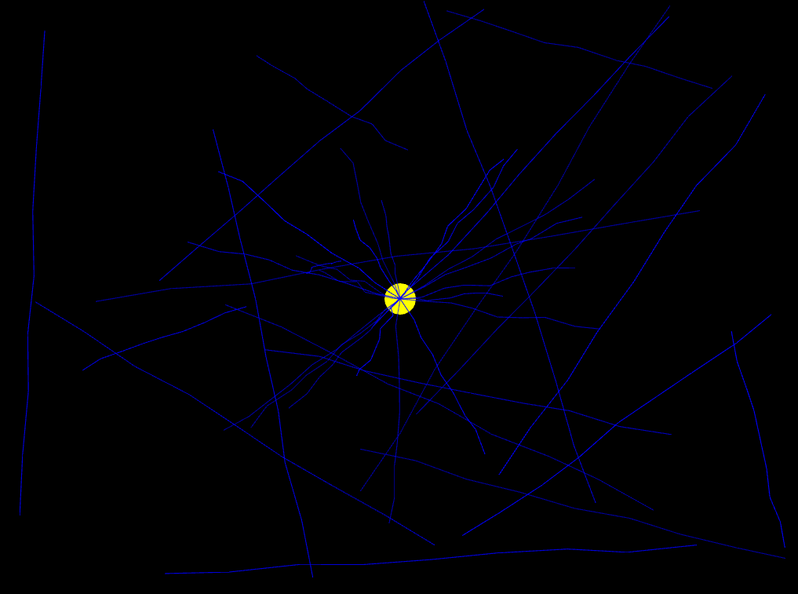

# RETO

## Preguntas para guiar el proceso

### Exploración creativa: ¿Qué tipo de efecto visual quieres lograr? ¿Cómo pueden ayudarte las diferentes estructuras de datos a lograr ese efecto?

El efecto visual que quiero generar es una esfera en el centro, y que cuando presione una tecla se generen rayos alrededor de la esfera, mientras que si presiono otra tacla, se generen rayos al azar por toda la pantalla, tambien quiero que cuando se generen los rayos, la pantalla cambie de color por muy poco tiempo para que sea como en la vida real y quiero que haya por lo menos cuatro colores diferentes de rayos.

La lista que me va a ayudar esto va a ser la lista RayList, que da un control secuencial para recorrer y dibujar todos los rayos activos, manteniendo el orden en que fueron añadidos. Esto es útil porque puedes renderizar cada rayo uno tras otro, y la pila va a ser (std::stack) permite borrar rayos en orden inverso al que se generaron (LIFO), lo que se traduce en un efecto de deshacer visual: los rayos más recientes desaparecen primero, simulando que la energía se disipa en orden contrario.

### Gestión de memoria: ¿Qué consideraciones debes tener en cuenta al gestionar dinámicamente la memoria de los objetos? ¿Cómo asegurar que no haya fugas de memoria?

Como se van a crear rayos dinamicamente en el heap con new, hay que tener en cuenta que hay que liberar memoria constantemente con delete y con cuidado para evitar fugas, evitar las dobles liberaciones para que el programa no se rompa y el destructor Raylist que limpia automaticamente todos los rayos al salir de la aplicación asegurando que no se siga gastando memoria.

### Interacción y dinamismo: ¿Cómo puedes hacer que la interacción del usuario influya en múltiples estructuras de datos simultáneamente para crear un efecto visual coherente y dinámico?

Basicamente, cuando el usuario presiona las teclas A o S, se agregan rayos tanto a la lista como a la pila y aparecen en pantalla. Tambien con los colores pero esto solo presionando la tecla D.

Cuando presiono la tecla W, se consulta a la pila y se eliminan los ultimos rayos generados de la lista y se borran de la pantalla, Esto genera un efecto dinámico y coherente porque las dos estructuras trabajan en sincronía, ya que la lista gestiona el dibujo y la pila gestiona el control interactivo del borrado.

### Optimización: ¿Qué técnicas puedes implementar para optimizar la gestión de memoria y el rendimiento de tu aplicación mientras mantienes una experiencia visual rica y fluida?

Podria hacer reutilización de objetos (no lo hice D:) para no usar new o delete usar un pool constante, tambien podria poner limites a los rayos (solo puse los que se generan con las teclas) para no sobresaturar, tambien esta Batch drawing, que si se llegan a miles de rayos, agrupar líneas en un ofMesh para que se dibujen en un solo draw call (esta opcion me la dijo chatgpt). y la verdad es que ya no sabria que optimizar porque este programa no es tan pesado que digamos entonces veo muy dificil que funcione lento.

## RETO HECHO Y RESULTADOS

### OFAPP.h
```cpp
#pragma once
#include "ofMain.h"
#include <stack> // para la pila

class Ray {
public:
    ofVec2f start, end;
    ofColor color;
    Ray* next;

    Ray(float x1, float y1, float x2, float y2, ofColor c) {
        start.set(x1, y1);
        end.set(x2, y2);
        color = c;
        next = nullptr;
    }
};

class RayList {
public:
    Ray* head;
    Ray* tail;
    int size;

    RayList() {
        head = tail = nullptr;
        size = 0;
    }

    ~RayList() {
        clear();
    }

    void addRay(Ray* newRay) {
        if (tail != nullptr) {
            tail->next = newRay;
            tail = newRay;
        }
        else {
            head = tail = newRay;
        }
        size++;
    }

    void removeLast() {
        if (!head) return;

        if (head == tail) {
            delete head;
            head = tail = nullptr;
        }
        else {
            Ray* current = head;
            while (current->next != tail) {
                current = current->next;
            }
            delete tail;
            tail = current;
            tail->next = nullptr;
        }
        size--;
    }

    void clear() {
        Ray* current = head;
        while (current != nullptr) {
            Ray* nextRay = current->next;
            delete current;
            current = nextRay;
        }
        head = tail = nullptr;
        size = 0;
    }

    void display() {
        Ray* current = head;
        while (current != nullptr) {
            ofColor flickerColor = current->color;
            flickerColor.a = ofRandom(150, 255);

            ofSetColor(flickerColor);

            int segments = 8;
            ofVec2f dir = (current->end - current->start) / segments;
            ofVec2f prevPoint = current->start;

            for (int i = 1; i <= segments; i++) {
                ofVec2f p = current->start + dir * i;
                p += ofVec2f(ofRandom(-5, 5), ofRandom(-5, 5));
                ofDrawLine(prevPoint, p);
                prevPoint = p;
            }

            current = current->next;
        }
    }
};

class ofApp : public ofBaseApp {
public:
    ofVec2f center;
    RayList rays;
    std::stack<Ray*> rayStack;  
    int colorMode;      
    bool flashActive;
    int flashTimer;
    int lastBatchSize;  

    void setup();
    void update();
    void draw();
    void keyPressed(int key);

    void triggerFlash();
};
```
### OFAPP.cpp

```cpp
#include "ofApp.h"

//--------------------------------------------------------------
void ofApp::setup() {
    ofSetFrameRate(60);
    center.set(ofGetWidth() / 2, ofGetHeight() / 2);
    colorMode = 0;   
    flashActive = false;
    flashTimer = 0;
    lastBatchSize = 0;
}

//--------------------------------------------------------------
void ofApp::update() {
    if (flashActive) {
        flashTimer--;
        if (flashTimer <= 0) {
            flashActive = false;
        }
    }
}

//--------------------------------------------------------------
void ofApp::draw() {
    // Fondo con flash
    if (flashActive) {
        ofSetBackgroundColor(255); 
    }
    else {
        ofSetBackgroundColor(0);   
    }

    ofSetColor(255, 255, 0);
    ofDrawCircle(center, 20);

    // Rayos
    rays.display();
}

//--------------------------------------------------------------
void ofApp::keyPressed(int key) {
    if (key == 'a') {
        int batch = 20;
        lastBatchSize = batch;

        for (int i = 0; i < batch; i++) {
            float angle = ofRandom(TWO_PI);
            float length = ofRandom(100, 300);
            ofVec2f end(center.x + cos(angle) * length,
                center.y + sin(angle) * length);

            ofColor c;
            if (colorMode == 0) c = ofColor(0, 0, 255);
            else if (colorMode == 1) c = ofColor(150, 0, 255);
            else if (colorMode == 2) c = ofColor(255, 255, 255);
            else c = ofColor(255, 140, 0);

            Ray* newRay = new Ray(center.x, center.y, end.x, end.y, c);
            rays.addRay(newRay);
            rayStack.push(newRay);
        }
        triggerFlash();
    }
    else if (key == 'd') {
        colorMode = (colorMode + 1) % 4;
    }
    else if (key == 's') {
        int batch = 20;
        lastBatchSize = batch;

        for (int i = 0; i < batch; i++) {
            ofVec2f start(ofRandom(ofGetWidth()), ofRandom(ofGetHeight()));
            ofVec2f end(ofRandom(ofGetWidth()), ofRandom(ofGetHeight()));

            ofColor c;
            if (colorMode == 0) c = ofColor(0, 0, 255);
            else if (colorMode == 1) c = ofColor(150, 0, 255);
            else if (colorMode == 2) c = ofColor(255, 255, 255);
            else c = ofColor(255, 140, 0);

            Ray* newRay = new Ray(start.x, start.y, end.x, end.y, c);
            rays.addRay(newRay);
            rayStack.push(newRay);
        }
        triggerFlash();
    }
    else if (key == 'w') {
        for (int i = 0; i < lastBatchSize && !rayStack.empty(); i++) {
            rays.removeLast();
            rayStack.pop();
        }
        lastBatchSize = 0; 
    }
}

//--------------------------------------------------------------
void ofApp::triggerFlash() {
    flashActive = true;
    flashTimer = 5; 
}
```
### FUNCIONAMIENTO DEL PROGRAMA

<video controls src="20250914-0517-59.4049201.mp4" title="Title"></video>

## CUMPLIMIENTO CON LAS CONDICIONES

### Combinación de estructuras de datos

Esta se cumple ya que el codigo usa la lista personalizada RayList y una pila std::stack<Ray*> rayStack, donde se combinan para manejar los rayos, generandolos y eliminandolos

```cpp
// OFAPP.h
class RayList { ... }; // Lista enlazada personalizada
std::stack<Ray*> rayStack; // Pila de punteros a Ray

//OFAPP.cpp
rays.addRay(newRay);
rayStack.push(newRay);

rays.removeLast();
rayStack.pop();
```




### Interactividad

Esta la cumple, de la siguiente manera

```cpp
if (key == 'a') { ... } // generar rayos desde el centro
else if (key == 's') { ... } // generar rayos aleatorios
else if (key == 'd') { ... } // cambiar modo de color
else if (key == 'w') { ... } // eliminar rayos
```
Ahora, asi se ve el programa al iniciar


Asi cuando presiono la tecla A


Asi cuando presiono la tecla S


Asi cuando presiono la tecla W (se borran los ultimos rayos generados)


Y cuando presiono la tecla D cambia de color, en la foto voy a poner todos los colores que hay que son azul, morado, blanco y naranja


### GESTION DE MEMORIA

Para comprobar esto, decidi agregar un destructor y ver si en la consola me soltaban los mensajes de que habia borrado bien, en especial le agregue esto:

```cpp
class Ray {
public:
    ofVec2f start, end;
    ofColor color;
    Ray* next;

    Ray(float x1, float y1, float x2, float y2, ofColor c) {
        start.set(x1, y1);
        end.set(x2, y2);
        color = c;
        next = nullptr;
        std::cout << "Ray creado en (" << x1 << "," << y1 << ")" << std::endl;
    }

    ~Ray() {
        std::cout << "Ray destruido en (" << start.x << "," << start.y << ")" << std::endl;
    }
};
```

Y al probar esto sale lo siguiente:

<video controls src="20250914-0552-20.9437264.mp4" title="Title"></video>

En resumen, funciona bien, aunque podria mejorar en ciertos aspectos, pero lo veo bien asi :D.


