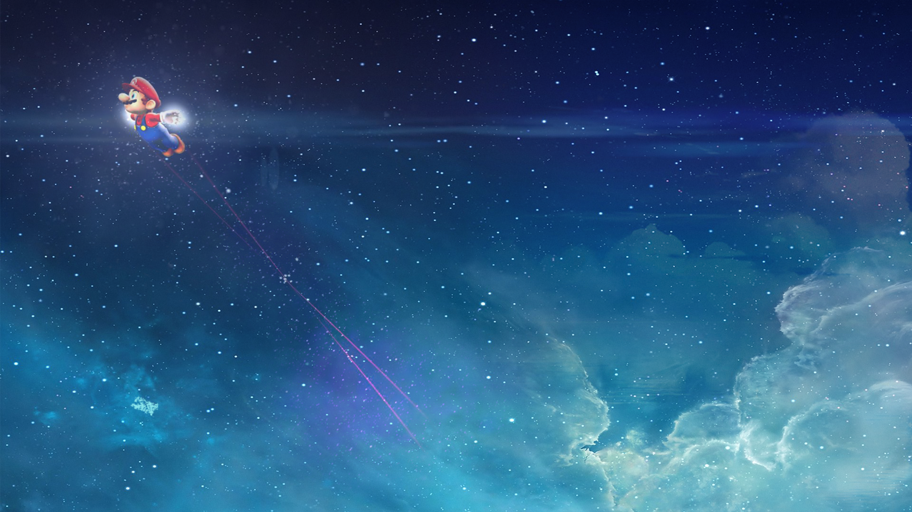
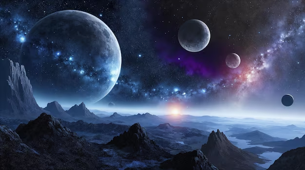
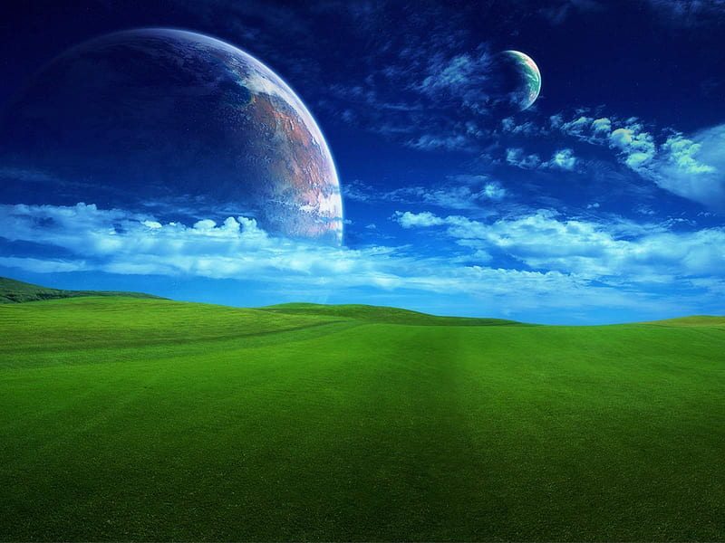
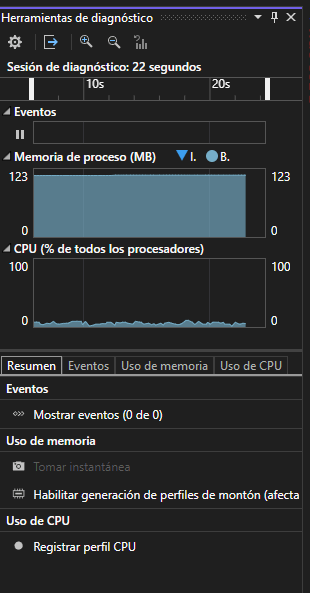

# RETO

## DESCRIPCIÓN DEL RETO: OBRA DE ARTE GENERATIVA

Lo que yo me imagino es como un paisaje espacial etereo, donde se vea como una superficie abajo de montañas y que lo que se vea como "Cielo" sea mas como si fuera el espacio exterior, donde se van a ver planetas que se van a ir moviendo y tambien van a aparecer estrellas fugaces y mas cosas como meteoritos, mas o menos como en estas referencias







Esta sería la idea inicial del proyecto, aunque puede que cambie si no me va gustando como va quedando.

ACTU: me gustaria agregar que al presionar el click el tiempo avance mas rapido por asi decirlo, y el paisaje avance como si tuviera noche y dia. Y tambien meterle nebulosas.

## ¿Como podria aplicar la herencia?

Quizas pueda tener una clase padre como objetoEspacial, que herede a otras clases que pueden estar en el proyecto como planeta, estrella fugaz, estrellas y meteoritos, donde cada uno hereda los atributos que tenga la clase padre y aparte de esto pueda agregar o modificar los comportamientos, tambien podria definir un comportamiento comun en la clase padre donde podria definir si los objetos tienen transparencia o como se van a mover. Aparte de esto, puedo tratar los objetos mas facil ya que comparten lo mismo que la clase padre, solo con leves modificaciones

## ¿Como podria aplicar el encapsulamiento?

Podria crear clases que representen objetos del mundo, como planeta, estrella, nebulosa, etc. Que aparte de heredar de una clase padre, estas mismas clases van a tener variables privadas o protegidas como lo pueden ser la posición, el tamaño, el color y metodos para actualizarlos. Por lo que al aplicar encapsulamiento puedo proteger las variables propias de cada una de esta clase, y asi poder hacer cambios sin tener que romper todo el sistema. Un ejemplo es que la clase de planeta va a tener una velocidad privada que no va a cambiar, pero puede haber un metodo publico que calcule la nueva posicion de este.

## ¿Como podria aplicar el polimorfismo?

Puedo tener un vector de la clase padre que contenga punteros a las clases heredadas, ya que no importa que sean de clases distintas, si todas heredan de la clase padre, puedo llamar a update y draw para que modifique todas las clases, es decir, tener una lista de todos los elementos del mundo  para actualizarlos o dibujarlos en un solo bucle.

## PRIMERA PRUEBA 

<video controls src="20250929-1336-05.5060616.mp4" title="Title"></video>

Aca se ven la primera prueba, como tal era solo para ver como iba a funcionar el movimiento de los planetas y de la nebulosa. Aunque tambien implemente la mecanica de cuando dejo click presionado, el tiempo pasa mas rapido.

## SEGUNDA PRUEBA

<video controls src="20250929-1341-58.3840899.mp4" title="Title"></video>

Aqui agregue lo que vendria a ser una temprana mecanica del ciclo dia/noche, pero funciona, aparte agregue esta especie de montañas abajito que se mueven y quedan muy bonito. En esta prueba solo tuve que agregar una clase adicional llamada fondo.

## TERCERA PRUEBA

<video controls src="20250929-1350-06.8317226.mp4" title="Title"></video>

Aqui ya agregue que los planetas no fueran pa donde sea y que nunca vuelvan, sino que sigan un camino horizontal y que al salir por el lado derecho de la pantalla, entre por el izquierdo. Tambien agregue las estrellas fugaces.

## CUARTA PRUEBA 

<video controls src="20250929-1355-13.1074778.mp4" title="Title"></video>

En esta parte le agregue al fondo estrellas estasticas para que se vea mas como el espacio exterior

# RESULTADO FINAL

<video controls src="Grabación de pantalla 2025-09-29 095923.mp4" title="Title"></video>

EL uso de memoria de esto, se queda estatico en los 123mb y un bajo uso de la cpu



Este es el resultado final despues de tantas pruebas y mas agregados. Lo que sigue es el codigo completo del programa.

## ObjetoEspacial.h

```cpp
#pragma once
#include "ofMain.h"

class ObjetoEspacial {
protected:
    ofVec2f posicion;
    float tamano;
    ofColor color;
    float transparencia;

public:
    ObjetoEspacial(ofVec2f pos, float t, ofColor c, float alpha = 255)
        : posicion(pos), tamano(t), color(c), transparencia(alpha) {}

    virtual ~ObjetoEspacial() {}

    void setPosicion(ofVec2f pos) { posicion = pos; }
    ofVec2f getPosicion() const { return posicion; }

    void setColor(ofColor c) { color = c; }
    ofColor getColor() const { return color; }

    void setTransparencia(float a) { transparencia = a; }
    float getTransparencia() const { return transparencia; }

    virtual void update(float dt) = 0;
    virtual void draw() = 0;
};
```
## Planeta.h

```cpp
#pragma once
#include "ObjetoEspacial.h"

class Planeta : public ObjetoEspacial {
private:
    float velocidad;

public:
    Planeta(ofVec2f pos, float t, ofColor c, float vel)
        : ObjetoEspacial(pos, t, c), velocidad(vel) {}

    void update(float dt) override {
        posicion.x += velocidad * dt;
        if (posicion.x > ofGetWidth() + tamano) {
            posicion.x = -tamano;
        }
        if (posicion.x < -tamano) {
            posicion.x = ofGetWidth() + tamano;
        }
    }

    void draw() override {
        ofSetColor(color, transparencia);
        ofDrawCircle(posicion, tamano);
    }
};
```

## Nebulosa.h

```cpp
#pragma once
#include "ObjetoEspacial.h"

class Nebulosa : public ObjetoEspacial {
private:
    float tiempo;

public:
    Nebulosa(ofVec2f pos, float t, ofColor c)
        : ObjetoEspacial(pos, t, c), tiempo(0) {}

    void update(float dt) override {
        tiempo += dt * 0.1;
    }

    void draw() override {
        ofMesh malla;
        malla.setMode(OF_PRIMITIVE_POINTS);

        int numPuntos = 2000;

        for (int i = 0; i < numPuntos; i++) {

            float x = ofRandomWidth();
            float y = ofRandomHeight();


            float dx = ofNoise(x * 0.001, y * 0.001, tiempo) * 50 - 25;
            float dy = ofNoise(x * 0.0015, y * 0.0015, tiempo + 100) * 50 - 25;

            ofVec3f vert(x + dx, y + dy, 0);

            float r = ofNoise(x * 0.002, y * 0.002, tiempo) * 255;
            float g = ofNoise(x * 0.0025, y * 0.0025, tiempo + 50) * 255;
            float b = ofNoise(x * 0.003, y * 0.003, tiempo + 100) * 255;

            malla.addColor(ofColor(r, g, b, 180));
            malla.addVertex(vert);
        }

        glPointSize(2.5);
        malla.draw();
        glPointSize(1.0);
    }
};
```
`
## EstrellaFugaz.h

```cpp

#pragma once
#include "ObjetoEspacial.h"

class EstrellaFugaz : public ObjetoEspacial {
private:
    ofVec2f velocidad;

public:
    EstrellaFugaz(ofVec2f pos, float t, ofColor c, ofVec2f vel)
        : ObjetoEspacial(pos, t, c), velocidad(vel) {}

    void update(float dt) override {
        posicion += velocidad * dt;
        transparencia -= 80 * dt; 
    }

    void draw() override {
        if (transparencia <= 0) return;

        ofSetColor(color, transparencia);
        ofDrawCircle(posicion, tamano);

        ofSetLineWidth(2);
        ofDrawLine(posicion, posicion - velocidad.getNormalized() * 40);
    }

    bool estaMuerta() const {
        return transparencia <= 0;
    }
};
```

## Fondo.h

```cpp
#pragma once
#include "ofMain.h"

class Fondo {
private:
    float tiempoGlobal;
    float cicloDuracion;
    ofColor colorDia;
    ofColor colorNoche;

    vector<ofVec2f> estrellasFijas;

public:
    Fondo(float duracion = 20.0f)
        : tiempoGlobal(0), cicloDuracion(duracion),
        colorDia(ofColor(100, 180, 255)),
        colorNoche(ofColor(10, 10, 30))
    {

        for (int i = 0; i < 300; i++) {
            estrellasFijas.push_back({ ofRandomWidth(), ofRandomHeight() });
        }
    }

    void update(float dt) {
        tiempoGlobal += dt;
    }

    void draw(int w, int h) {
        float fase = fmod(tiempoGlobal, cicloDuracion) / cicloDuracion;
        ofColor fondo = colorDia.getLerped(colorNoche, sin(fase * TWO_PI) * 0.5 + 0.5);

        ofMesh gradiente;
        gradiente.setMode(OF_PRIMITIVE_TRIANGLE_STRIP);
        gradiente.addVertex(ofVec3f(0, 0, 0));
        gradiente.addColor(fondo);
        gradiente.addVertex(ofVec3f(w, 0, 0));
        gradiente.addColor(fondo);
        gradiente.addVertex(ofVec3f(0, h, 0));
        gradiente.addColor(ofColor::black);
        gradiente.addVertex(ofVec3f(w, h, 0));
        gradiente.addColor(ofColor::black);
        gradiente.draw();

        ofSetColor(255);
        for (auto& e : estrellasFijas) {
            ofDrawCircle(e, 1.5);
        }

        ofSetColor(20, 30, 60);
        ofBeginShape();
        for (int x = 0; x <= w; x += 15) {
            float y = h - 50 - ofNoise(x * 0.01, tiempoGlobal * 0.05) * 150;
            ofVertex(x, y);
        }
        ofVertex(w, h);
        ofVertex(0, h);
        ofEndShape(true);

        ofColor nieveDia(255, 255, 255);
        ofColor nieveNoche(180, 200, 230);
        ofColor nieveActual = nieveDia.getLerped(nieveNoche, sin(fase * TWO_PI) * 0.5 + 0.5);

        ofSetColor(nieveActual);
        ofBeginShape();
        for (int x = 0; x <= w; x += 25) {
            float y = h - 200 - ofNoise(x * 0.03, tiempoGlobal * 0.02) * 300;
            ofVertex(x, y);
        }
        ofVertex(w, h);
        ofVertex(0, h);
        ofEndShape(true);


        ofSetColor(40, 70, 120);
        ofBeginShape();
        for (int x = 0; x <= w; x += 20) {
            float y = h - 100 - ofNoise(x * 0.02, tiempoGlobal * 0.03) * 200;
            ofVertex(x, y);
        }
        ofVertex(w, h);
        ofVertex(0, h);
        ofEndShape(true);
    }
};
```

## OfApp.h

```cpp
#pragma once
#include "ofMain.h"
#include "../ObjetoEspacial.h"
#include "../Planeta.h"
#include "../EstrellaFugaz.h"
#include "../Nebulosa.h"
#include "../Fondo.h"


class ofApp : public ofBaseApp {
public:
    vector<ObjetoEspacial*> objetos;
    Fondo fondo;
    float tiempoEscala;
    bool mousePressedActive;

    void setup();
    void update();
    void draw();
    void mousePressed(int x, int y, int button);
    void mouseReleased(int x, int y, int button);
    void exit();
};
```

## OfApp.cpp

```cpp
#include "ofApp.h"

void ofApp::setup() {
    ofBackground(0);
    tiempoEscala = 1.0f;
    mousePressedActive = false;

    fondo = Fondo(30.0f);

    objetos.push_back(new Planeta({ 100,150 }, 40, ofColor::blue, 40));
    objetos.push_back(new Planeta({ 300,250 }, 60, ofColor::red, 20));
    objetos.push_back(new Planeta({ 500,100 }, 30, ofColor::green, 60));

    objetos.push_back(new Nebulosa({ 400,200 }, 200, ofColor(200, 100, 255, 120)));

    for (int i = 0; i < 5; i++) {
        objetos.push_back(new EstrellaFugaz({ ofRandomWidth(), ofRandomHeight() / 2 },
            6, ofColor::white,
            { ofRandom(-200, -100), ofRandom(100, 200) }));
    }
}

void ofApp::update() {
    float dt = ofGetLastFrameTime();

    tiempoEscala = mousePressedActive ? 4.0f : 1.0f;

    fondo.update(dt * tiempoEscala);

    for (auto& obj : objetos) {
        obj->update(dt * tiempoEscala);
    }

    for (int i = objetos.size() - 1; i >= 0; i--) {
        EstrellaFugaz* ef = dynamic_cast<EstrellaFugaz*>(objetos[i]);
        if (ef && ef->estaMuerta()) {
            delete objetos[i];
            objetos.erase(objetos.begin() + i);

            objetos.push_back(new EstrellaFugaz({ ofRandomWidth(), ofRandomHeight() / 2 },
                6, ofColor::white,
                { ofRandom(-200, -100), ofRandom(100, 200) }));
        }
    }
}

void ofApp::draw() {
    fondo.draw(ofGetWidth(), ofGetHeight());
    for (auto& obj : objetos) {
        obj->draw();
    }
}

void ofApp::mousePressed(int x, int y, int button) {
    mousePressedActive = true;
}

void ofApp::mouseReleased(int x, int y, int button) {
    mousePressedActive = false;
}

void ofApp::exit() {
    for (auto& obj : objetos) {
        delete obj;
    }
    objetos.clear();
}
```

## ¿COMO SE APLICARON AL FINAL LOS CONCEPTOS EN COMPARACIÓN A LOS QUE DIJE EN UN INICIO?

En el caso de la herencia, esta se aplico usando una clase padre que llame ObjetoEspacial, que tiene de hijos a Planeta, Nebulosa y Estrella fugaz. Ya que estas clases comparten los atributos que se heredan de la clase padre, como tamaño, posicion, color y metodos como update y draw. 

En el caso del polimorfismo, hice que el metodo update y draw funcione de igual manera para todos los objetos, gracias  a un vector del puntero de ObjetoEspacial.

```cpp
vector<ObjetoEspacial*> objetos;

for (auto& obj : objetos) {
    obj->update(dt);  
    obj->draw();      
}

```
Al recorrer el vector en objetos, se invoca el metodo correcto dependiendo del tipo real del objeto, lo que permite tratar todos los objetos especiales de una manera uniforme, aunque con un comportamiento especifico.

En el caso del encapsulamiento, lo use en la clase padre para proteger sus atributos y dejar publicos sus metodos, para a traves de estos modificar o consultar valores, lo que mantiene los datos internos seguros y controlados para que no surjan errores.

Ya el manejo de memoria, uso new para crear objetos de tipo ObjetoEspacial   y sus derivadas para meterlos en el heap, donde implemente un exit para liberar la memoria con delete, logrando evitar fugas de memoria. Aparte, las estrellas fugaces se reutilizan, ya que al morir se llama al metodo estaMuerta y genera nuevas estrellas fugaces.

```cpp
objetos.push_back(new Planeta(...));
objetos.push_back(new EstrellaFugaz(...));

for (auto& obj : objetos) {
    delete obj;
}
objetos.clear();
```

Eso seria todo

