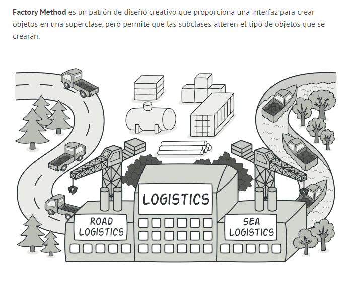
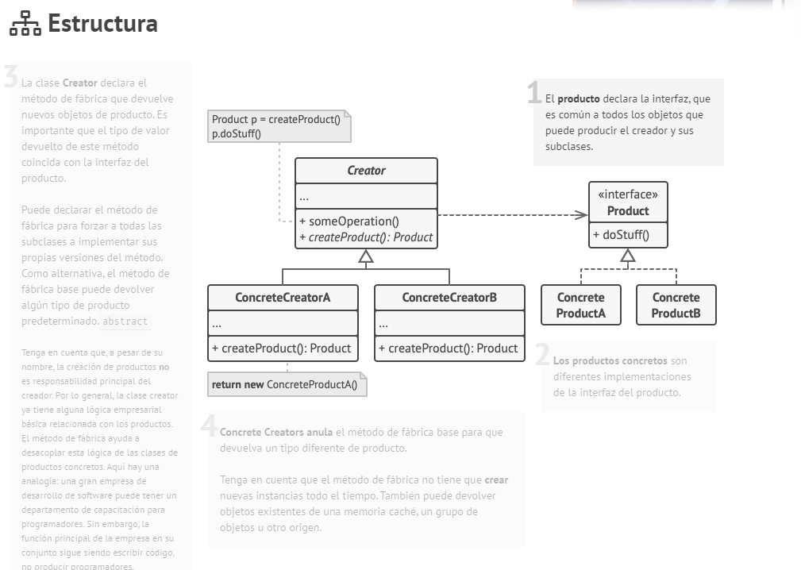
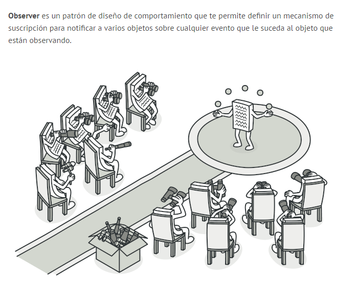
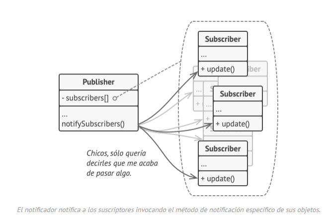
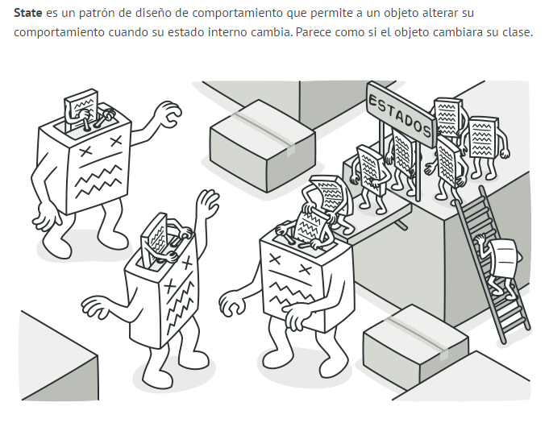
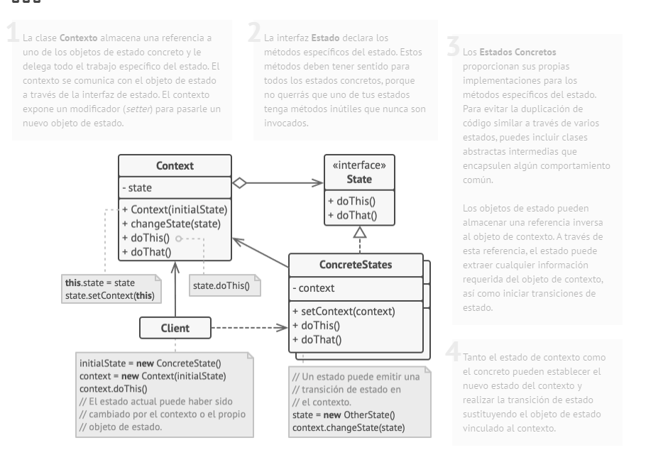

# INVESTIGACIÓN

## SESIÓN 1: INVESTIGACIÓN

### PATRON FACTORY

Basicamente este es un patrón que funciona mediante herencia, es decir una superclase hereda sus atributos a subclases, aunque esta misma use interfaces para que se pueda aplicar. Lo que pasa es que este patrón genera por asi decirlo objetos por defecto, y ya depende del programador modificarlos, es decir, guarda lo de la suerclase pero se pueden editar cosas de esta en la subclase.



El código que usa el método de fábrica (a menudo denominado código de cliente) no ve una diferencia entre los productos reales devueltos por varias subclases. El cliente trata todos los productos como abstractos. El cliente sabe que se supone que todos los objetos de transporte tienen el método, pero exactamente cómo funciona no es importante para el cliente.



### PATRON OBSERVER

Este es un patron que esta pendiente de todo lo que tenga una suscripción, donde se le notifica a estos mismos sobre cualquier evento que le pueda suceder al objeto que estan observando. Es decir, este patron se usa mas para notificar a los demas objetos sobre los eventos que se van a aplicar en el programa.



Ahora, cuando le sucede un evento importante al notificador, recorre sus suscriptores y llama al método de notificación específico de sus objetos.

Este patron facilita la opcion de usar suscripciones, ya que al usar una interfaz no es necesario tener multiples clases apra notificar sobre cada evento, simplemente con esta interfaz podemos notificar a bastantes objetos sobre uno u varios comportamientos en especifico



### PATRON STATE

Este patron permite a un objeto alterar su comportamiento cuando su estado interno cambia, como si reemplazara una clase por otra.



El patrón State sugiere que crees nuevas clases para todos los estados posibles de un objeto y extraigas todos los comportamientos específicos del estado para colocarlos dentro de esas clases. Donde el objeto original almacena referencias a los objetos de estado y delega el trabajo relacionado con el objeto a ese estado.




Gracias a Refactoring Guru por la info <3

## SESIÓN 2: análisis de un caso de estudio

### OFAPP.H

```cpp
#pragma once

#include "ofMain.h"
#include <vector>
#include <string>

class Observer {
public:
    virtual void onNotify(const std::string& event) = 0;
};

class Subject {
public:
    void addObserver(Observer* observer);
    void removeObserver(Observer* observer);
protected:
    void notify(const std::string& event);
private:
    std::vector<Observer*> observers;
};

class Particle;

class State {
public:
    virtual void update(Particle* particle) = 0;
    virtual void onEnter(Particle* particle) {}
    virtual void onExit(Particle* particle) {}
    virtual ~State() = default;
};

class Particle : public Observer {
public:
    Particle();
    ~Particle();

    void update();
    void draw();
    void onNotify(const std::string& event) override;
    void setState(State* newState);

    ofVec2f position;
    ofVec2f velocity;
    float size;
    ofColor color;

private:
    State* state;
};


class NormalState : public State {
public:
    void update(Particle* particle) override;
    virtual void onEnter(Particle* particle) override;
};


class AttractState : public State {
public:
    void update(Particle* particle) override;
};

class RepelState : public State {
public:
    void update(Particle* particle) override;
};

class StopState : public State {
public:
    void update(Particle* particle) override;
};

class ParticleFactory {
public:
    static Particle* createParticle(const std::string& type);
};

class ofApp : public ofBaseApp, public Subject {
    public:
        void setup();
        void update();
        void draw();
        void keyPressed(int key);
private:
    std::vector<Particle*> particles;
};
```

### OFAPP.CPP

```cpp
#include "ofApp.h"

void Subject::addObserver(Observer* observer) {
    observers.push_back(observer);
}

void Subject::removeObserver(Observer* observer) {
    observers.erase(std::remove(observers.begin(), observers.end(), observer), observers.end());
}

void Subject::notify(const std::string& event) {
    for (Observer* observer : observers) {
        observer->onNotify(event);
    }
}

Particle::Particle() {
    // Inicializar propiedades
    position = ofVec2f(ofRandomWidth(), ofRandomHeight());
    velocity = ofVec2f(ofRandom(-0.5f, 0.5f), ofRandom(-0.5f, 0.5f));
    size = ofRandom(2, 5);
    color = ofColor(255);

    state = new NormalState();
}

Particle::~Particle() {
    delete state;
}

void Particle::setState(State* newState) {
    if (state != nullptr) {
        state->onExit(this);
        delete state;
    }
    state = newState;
    if (state != nullptr) {
        state->onEnter(this);
    }
}

void Particle::update() {
    if (state != nullptr) {
        state->update(this);
    }
    // Mantener las partículas dentro de la ventana
    if (position.x < 0 || position.x > ofGetWidth()) velocity.x *= -1;
    if (position.y < 0 || position.y > ofGetHeight()) velocity.y *= -1;
}

void Particle::draw() {
    ofSetColor(color);
    ofDrawCircle(position, size);
}

void Particle::onNotify(const std::string& event) {
    if (event == "attract") {
        setState(new AttractState());
    }
    else if (event == "repel") {
        setState(new RepelState());
    }
    else if (event == "stop") {
        setState(new StopState());
    }
    else if (event == "normal") {
        setState(new NormalState());
    }
}

void NormalState::update(Particle* particle) {
    particle->position += particle->velocity;
}

void NormalState::onEnter(Particle* particle) {
    particle->velocity = ofVec2f(ofRandom(-0.5f, 0.5f), ofRandom(-0.5f, 0.5f));
}

void AttractState::update(Particle* particle) {
    ofVec2f mousePosition(((ofApp*)ofGetAppPtr())->mouseX, ((ofApp*)ofGetAppPtr())->mouseY);
    ofVec2f direction = mousePosition - particle->position;
    direction.normalize();
    particle->velocity += direction * 0.05;
    ofClamp(particle->velocity.x, -3, 3);
    particle->position += particle->velocity * 0.2;
}

void RepelState::update(Particle* particle) {
    ofVec2f mousePosition(((ofApp*)ofGetAppPtr())->mouseX, ((ofApp*)ofGetAppPtr())->mouseY);
    ofVec2f direction = particle->position - mousePosition;
    direction.normalize();
    particle->velocity += direction * 0.05;
    ofClamp(particle->velocity.x, -3, 3);
    particle->position += particle->velocity * 0.2;
}

void StopState::update(Particle* particle) {
    particle->velocity.x = 0;
    particle->velocity.y = 0;
}

Particle* ParticleFactory::createParticle(const std::string& type) {
    Particle* particle = new Particle();

    if (type == "star") {
        particle->size = ofRandom(2, 4);
        particle->color = ofColor(255, 0, 0);
    }
    else if (type == "shooting_star") {
        particle->size = ofRandom(3, 6);
        particle->color = ofColor(0, 255, 0);
        particle->velocity *= 3;
    }
    else if (type == "planet") {
        particle->size = ofRandom(5, 8);
        particle->color = ofColor(0, 0, 255);
    }
    return particle;
}


void ofApp::setup() {
    ofBackground(0);
    // Crear partículas usando la fábrica
    for (int i = 0; i < 100; ++i) {
        Particle* p = ParticleFactory::createParticle("star");
        particles.push_back(p);
        addObserver(p);
    }

    for (int i = 0; i < 5; ++i) {
        Particle* p = ParticleFactory::createParticle("shooting_star");
        particles.push_back(p);
        addObserver(p);
    }

    for (int i = 0; i < 10; ++i) {
        Particle* p = ParticleFactory::createParticle("planet");
        particles.push_back(p);
        addObserver(p);
    }

}


void ofApp::update() {
    for (Particle* p : particles) {
        p->update();
    }
}


void ofApp::draw() {
    for (Particle* p : particles) {
        p->draw();
    }
}

void ofApp::keyPressed(int key) {
    if (key == 's') {
        notify("stop");
    }
    else if (key == 'a') {
        notify("attract");
    }
    else if (key == 'r') {
        notify("repel");
    }
    else if (key == 'n') {
        notify("normal");
    }
}
```
<video controls src="20251007-0422-35.1586405.mp4" title="Title"></video>

### ¿Qué hace el patrón observer en este caso?

Permite que la clase ofApp notifique a todas las particulas cuando ocurre un evento determinado, como no se, presionar una tecla. Cada particula implementa la interfaz Observer a traves del onNotify, lo que le da la opción de reaccionar de forma independiente a los mensajes enviados por la clase ofApp. De esta manera, cuando ofApp llama al metodo onNotify, digamos en el caso de attract, todas las particulas reciben el mensaje y cambian su estado para comportarse de manera diferente.

### ¿Qué hace el patrón factory en este caso?

Se encarga de la creación de particulas según el tipo. La clase ParticleFactory tiene un metodo donde crea una nueva particula que puede ser star, shooting_star o planet, y ajusta sus propiedades iniciales como el tamaño, color y velocidad según el tipo que se desea crear.

### ¿Qué hace el patrón state en este caso?

Cambia dinamicamente el comportamiento de cada particula segun el estado que tenga en ese momento, donde cada particula posee un puntero a un objeto de tipo state que define como debe actualizarse y moverse. En esta parte existen varias subclases como lo es NormalState, AttractState, RepelState y Stopstate, cada una con una implementación distinta del método update. Por ejemplo, en el estado normal las partículas se mueven libremente, en el estado de atracción se dirigen hacia el puntero del ratón, y en el estado de detención permanecen quietas. Cuando una partícula recibe una notificación de evento, cambia su estado mediante el método setState, que gestiona la salida del estado anterior y la entrada del nuevo.

### EXPERIMENTOS

```cpp
#pragma once

#include "ofMain.h"
#include <vector>
#include <string>

class Observer {
public:
    virtual void onNotify(const std::string& event) = 0;
};

class Subject {
public:
    void addObserver(Observer* observer);
    void removeObserver(Observer* observer);
protected:
    void notify(const std::string& event);
private:
    std::vector<Observer*> observers;
};

class Particle;

class State {
public:
    virtual void update(Particle* particle) = 0;
    virtual void onEnter(Particle* particle) {}
    virtual void onExit(Particle* particle) {}
    virtual ~State() = default;
};

class Particle : public Observer {
public:
    Particle();
    ~Particle();

    void update();
    void draw();
    void onNotify(const std::string& event) override;
    void setState(State* newState);

    ofVec2f position;
    ofVec2f velocity;
    float size;
    ofColor color;

private:
    State* state;
};


class NormalState : public State {
public:
    void update(Particle* particle) override;
    virtual void onEnter(Particle* particle) override;
};


class AttractState : public State {
public:
    void update(Particle* particle) override;
};

class RepelState : public State {
public:
    void update(Particle* particle) override;
};

class StopState : public State {
public:
    void update(Particle* particle) override;
};

class ParticleFactory {
public:
    static Particle* createParticle(const std::string& type);
};

class ofApp : public ofBaseApp, public Subject {
    public:
        void setup();
        void update();
        void draw();
        void keyPressed(int key);
private:
    std::vector<Particle*> particles;
};


// ===================== NUEVAS CLASES =====================

// Nuevo estado: rebote energético
class BounceState : public State {
public:
    void update(Particle* particle) override;
    void onEnter(Particle* particle) override;
};
```

```cpp
#include "ofApp.h"

void Subject::addObserver(Observer* observer) {
    observers.push_back(observer);
}

void Subject::removeObserver(Observer* observer) {
    observers.erase(std::remove(observers.begin(), observers.end(), observer), observers.end());
}

void Subject::notify(const std::string& event) {
    for (Observer* observer : observers) {
        observer->onNotify(event);
    }
}

Particle::Particle() {
    // Inicializar propiedades
    position = ofVec2f(ofRandomWidth(), ofRandomHeight());
    velocity = ofVec2f(ofRandom(-0.5f, 0.5f), ofRandom(-0.5f, 0.5f));
    size = ofRandom(2, 5);
    color = ofColor(255);

    state = new NormalState();
}

Particle::~Particle() {
    delete state;
}

void Particle::setState(State* newState) {
    if (state != nullptr) {
        state->onExit(this);
        delete state;
    }
    state = newState;
    if (state != nullptr) {
        state->onEnter(this);
    }
}

void Particle::update() {
    if (state != nullptr) {
        state->update(this);
    }
    // Mantener las partículas dentro de la ventana
    if (position.x < 0 || position.x > ofGetWidth()) velocity.x *= -1;
    if (position.y < 0 || position.y > ofGetHeight()) velocity.y *= -1;
}

void Particle::draw() {
    ofSetColor(color);
    ofDrawCircle(position, size);
}

void Particle::onNotify(const std::string& event) {
    if (event == "attract") {
        setState(new AttractState());
    }
    else if (event == "repel") {
        setState(new RepelState());
    }
    else if (event == "stop") {
        setState(new StopState());
    }
    else if (event == "normal") {
        setState(new NormalState());
    }
    // NUEVO EVENTO
    else if (event == "bounce") {
        setState(new BounceState());
    }
}

void NormalState::update(Particle* particle) {
    particle->position += particle->velocity;
}

void NormalState::onEnter(Particle* particle) {
    particle->velocity = ofVec2f(ofRandom(-0.5f, 0.5f), ofRandom(-0.5f, 0.5f));
}

void AttractState::update(Particle* particle) {
    ofVec2f mousePosition(((ofApp*)ofGetAppPtr())->mouseX, ((ofApp*)ofGetAppPtr())->mouseY);
    ofVec2f direction = mousePosition - particle->position;
    direction.normalize();
    particle->velocity += direction * 0.05;
    ofClamp(particle->velocity.x, -3, 3);
    particle->position += particle->velocity * 0.2;
}

void RepelState::update(Particle* particle) {
    ofVec2f mousePosition(((ofApp*)ofGetAppPtr())->mouseX, ((ofApp*)ofGetAppPtr())->mouseY);
    ofVec2f direction = particle->position - mousePosition;
    direction.normalize();
    particle->velocity += direction * 0.05;
    ofClamp(particle->velocity.x, -3, 3);
    particle->position += particle->velocity * 0.2;
}

void StopState::update(Particle* particle) {
    particle->velocity.x = 0;
    particle->velocity.y = 0;
}

Particle* ParticleFactory::createParticle(const std::string& type) {
    Particle* particle = new Particle();

    if (type == "star") {
        particle->size = ofRandom(2, 4);
        particle->color = ofColor(255, 0, 0);
    }
    else if (type == "shooting_star") {
        particle->size = ofRandom(3, 6);
        particle->color = ofColor(0, 255, 0);
        particle->velocity *= 3;
    }
    else if (type == "planet") {
        particle->size = ofRandom(5, 8);
        particle->color = ofColor(0, 0, 255);
    }
    // NUEVO TIPO DE PARTÍCULA
    else if (type == "comet") {
        particle->size = ofRandom(6, 10);
        particle->color = ofColor(255, 150, 0);
        particle->velocity = ofVec2f(ofRandom(-2, 2), ofRandom(-2, 2));
    }

    return particle;
}


void ofApp::setup() {
    ofBackground(0);
    // Crear partículas usando la fábrica
    for (int i = 0; i < 100; ++i) {
        Particle* p = ParticleFactory::createParticle("star");
        particles.push_back(p);
        addObserver(p);
    }

    for (int i = 0; i < 5; ++i) {
        Particle* p = ParticleFactory::createParticle("shooting_star");
        particles.push_back(p);
        addObserver(p);
    }

    for (int i = 0; i < 10; ++i) {
        Particle* p = ParticleFactory::createParticle("planet");
        particles.push_back(p);
        addObserver(p);
    }
}


void ofApp::update() {
    for (Particle* p : particles) {
        p->update();
    }
}


void ofApp::draw() {
    for (Particle* p : particles) {
        p->draw();
    }
}

void ofApp::keyPressed(int key) {
    if (key == 's') {
        notify("stop");
    }
    else if (key == 'a') {
        notify("attract");
    }
    else if (key == 'r') {
        notify("repel");
    }
    else if (key == 'n') {
        notify("normal");
    }
    // NUEVO EVENTO
    else if (key == 'b') {
        notify("bounce");
    }
}


// ===================== NUEVO ESTADO =====================

void BounceState::onEnter(Particle* particle) {
    particle->color = ofColor(255, 150, 0); // naranja brillante
    particle->velocity = ofVec2f(ofRandom(-3, 3), ofRandom(-3, 3));
}

void BounceState::update(Particle* particle) {
    particle->position += particle->velocity;

    // Rebote con fuerza al tocar los bordes
    if (particle->position.x < 0 || particle->position.x > ofGetWidth()) {
        particle->velocity.x *= -1.2;
    }
    if (particle->position.y < 0 || particle->position.y > ofGetHeight()) {
        particle->velocity.y *= -1.2;
    }

    // Desvanecer gradualmente para dar efecto de estela
    particle->color.a = ofClamp(particle->color.a - 1, 100, 255);
}

```


