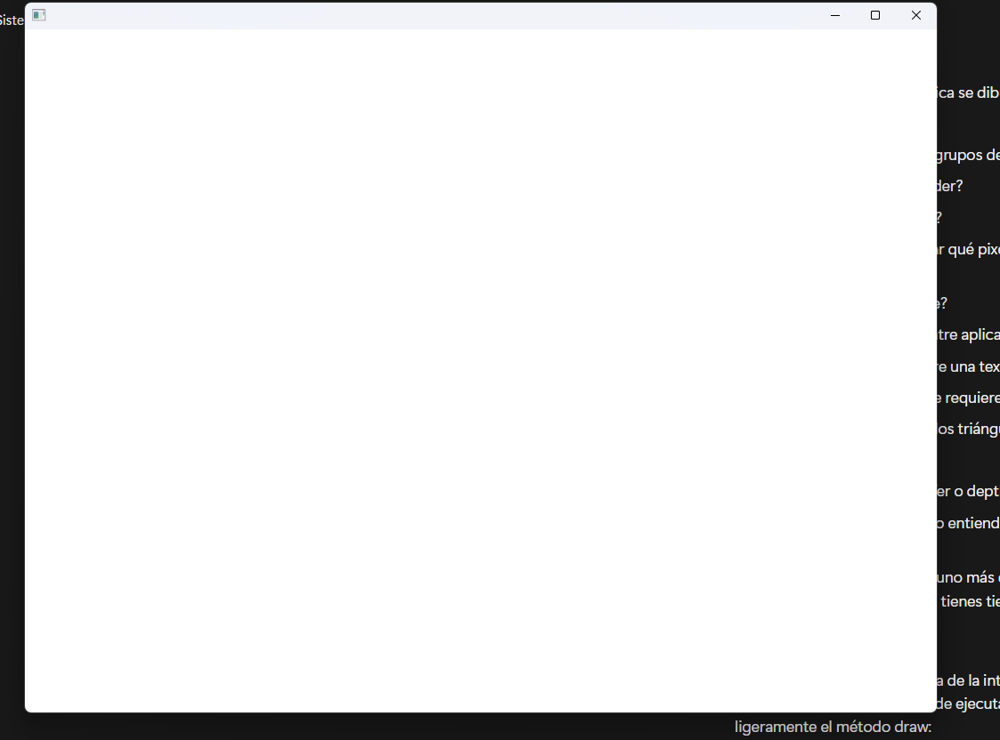
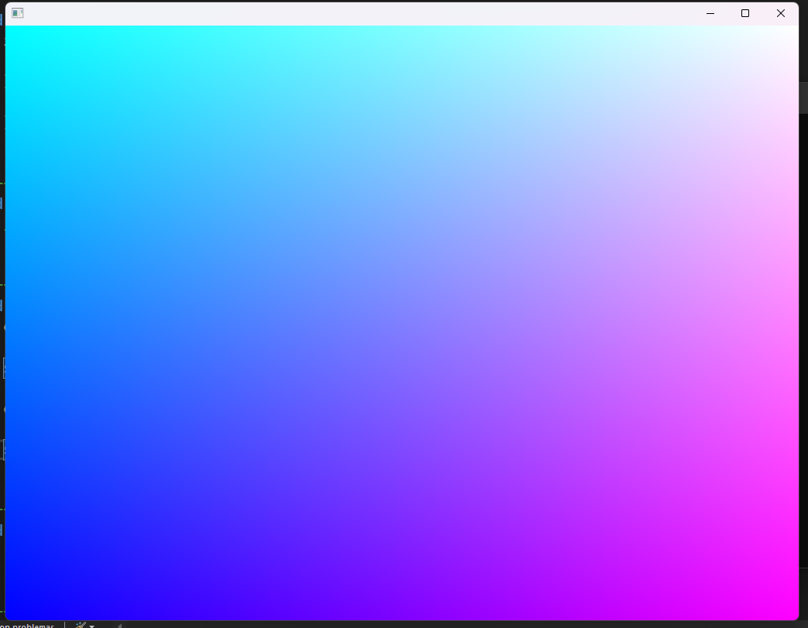
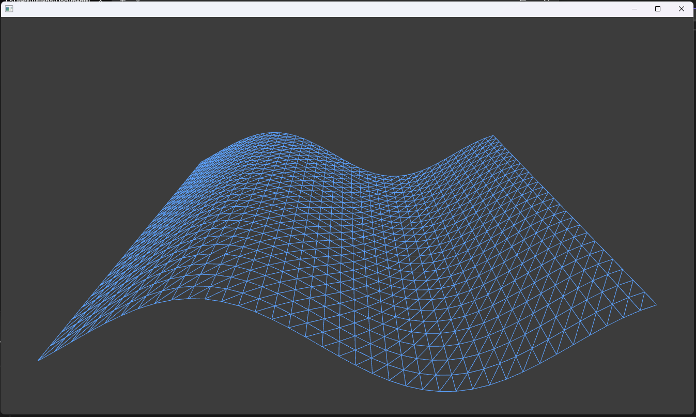
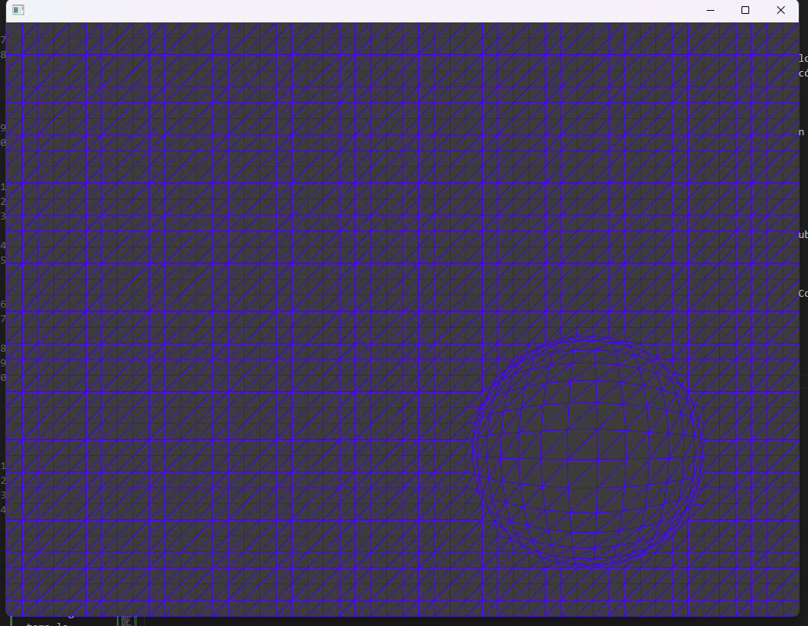
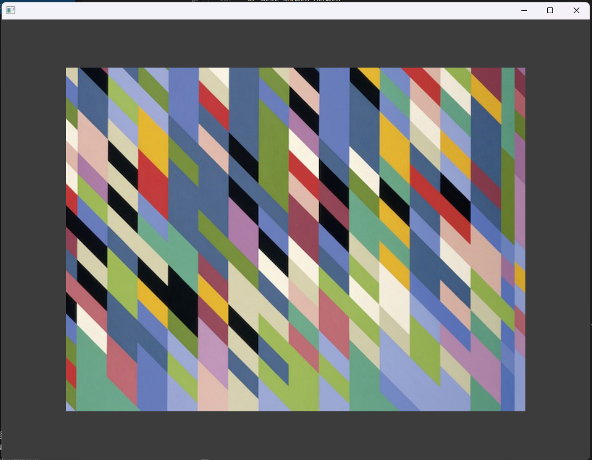
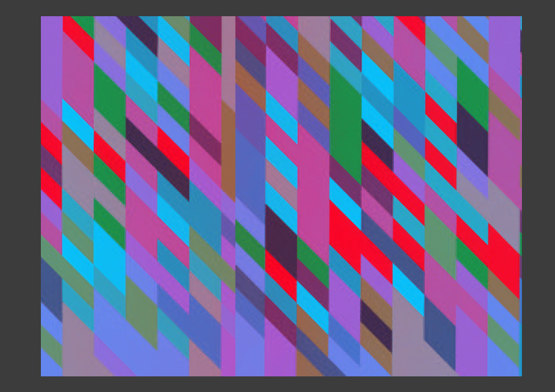
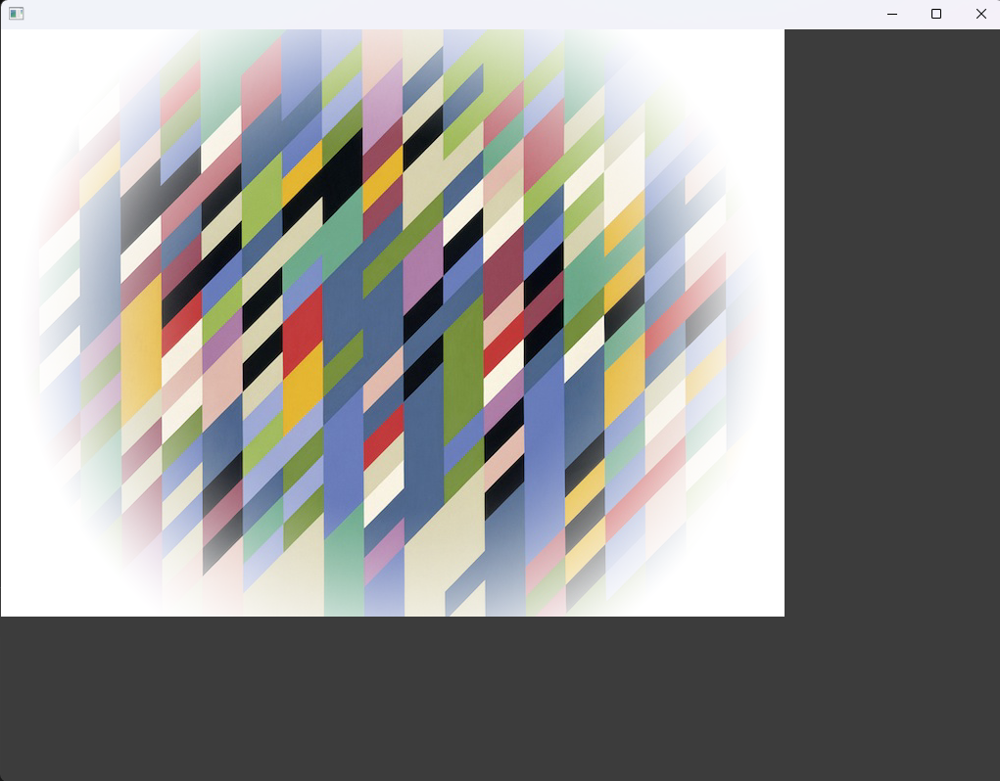
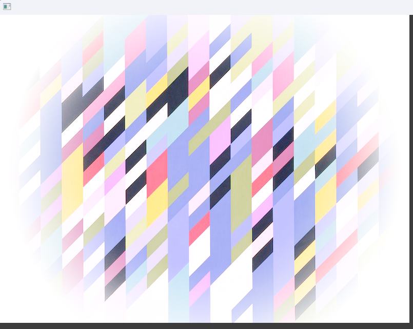
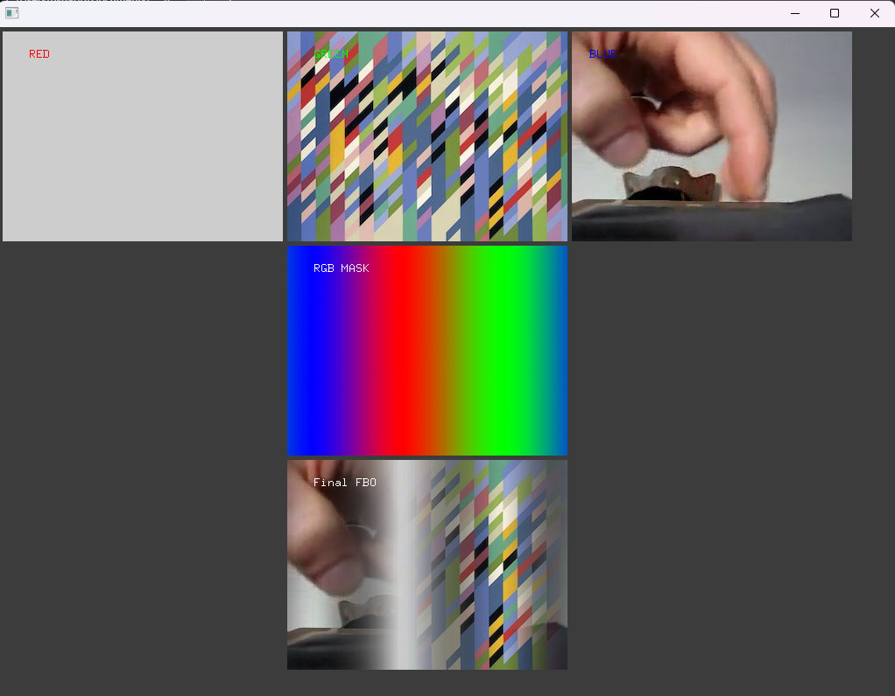
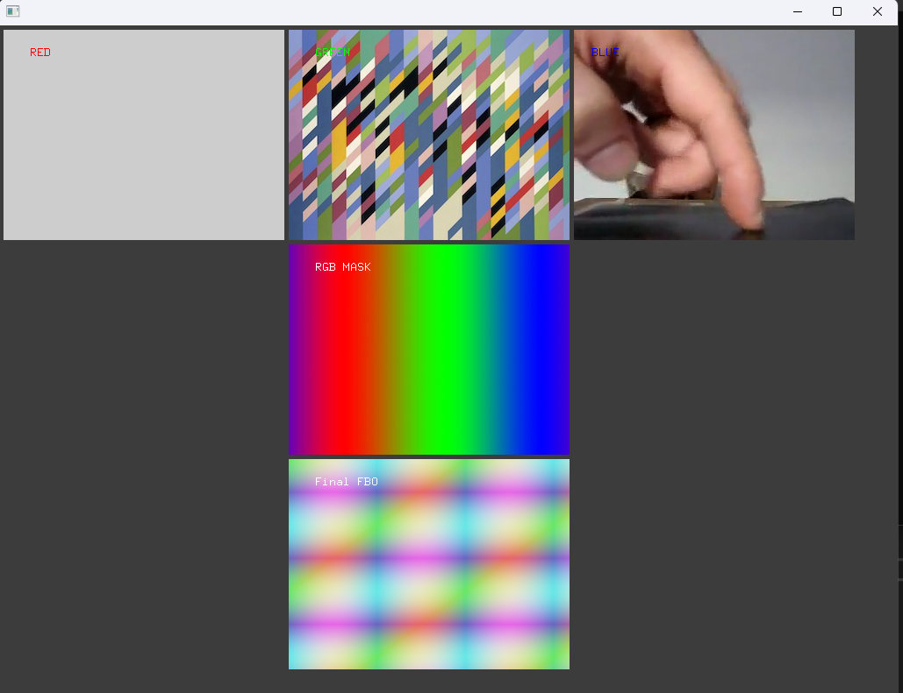

# INVESTIGACIÓN

# ACTIVIDAD 1

### ¿Qué son los vértices?
Los vértices son puntos que marcan la forma de un objeto 3D. Cada vértice tiene una posición en el espacio (x, y, z) y puede tener información adicional como color o coordenadas de textura. Al conectar varios vértices se crean los triángulos que forman el modelo.

### ¿Con qué figura geométrica se dibuja en 3D?
Se utiliza el triángulo. Es la figura básica en los gráficos 3D porque con tres puntos se puede definir cualquier superficie sin ambigüedades.

### ¿Qué es un shader?
Un shader es un programa que se ejecuta en la GPU y que le dice al sistema cómo debe mostrarse un objeto en pantalla. Controla aspectos como el color, la luz, las sombras o los efectos visuales.

### ¿Cómo se le llaman a los grupos de píxeles de un mismo triángulo?
A esos grupos se les conoce como fragmentos. Cada fragmento representa un píxel posible del triángulo que será procesado antes de mostrarse.

### ¿Qué es un fragment shader?
Es un tipo de shader que trabaja con los fragmentos. Su función es determinar el color final de cada píxel, aplicando efectos de iluminación, textura o transparencia.

### ¿Qué es un vertex shader?
Es el shader encargado de procesar los vértices de los modelos. Se usa para transformar las posiciones 3D al espacio de la cámara y luego a la pantalla, además de aplicar rotaciones, escalas o movimientos.

###  ¿Al proceso de determinar qué pixels del display va a cubrir cada triángulo de una mesh se le llama?
Ese proceso se llama rasterización. Es el paso donde los triángulos se convierten en fragmentos que luego se colorean.

### ¿Qué es el render pipeline?
Es la secuencia de pasos que realiza la GPU para pasar de los datos 3D a una imagen 2D visible. Incluye la transformación de los vértices, la rasterización, los shaders y la escritura en el framebuffer.

### ¿Hay alguna diferencia entre aplicar un color a una superficie de una mesh o aplicar una textura?
Sí. Aplicar un color significa pintar todo el objeto con un mismo tono, mientras que una textura es una imagen que se coloca sobre la superficie para darle más detalle y realismo.

###  ¿Cuál es la diferencia entre una textura y un material?
La textura es solo una imagen que da apariencia visual, pero el material incluye además propiedades físicas como el brillo, la transparencia o la forma en que refleja la luz.

### ¿Qué transformaciones se requieren para mover un vértice del 3D world al View Screen?
Se aplican tres tipos de transformaciones:

- Model: coloca el objeto en su posición dentro del mundo.

- View: ajusta la cámara o el punto de vista.

- Projection: transforma las coordenadas 3D en coordenadas de pantalla (2D).

### ¿Al proceso de convertir los triángulos en fragmentos se le llama?
Se llama rasterización, el mismo proceso que traduce la geometría en píxeles listos para ser dibujados.

### ¿Qué es el framebuffer?
Es una zona de memoria donde se almacena la imagen final que se mostrará en pantalla. Guarda el color y otros datos de cada píxel procesado.

### ¿Para qué se usa el Z-buffer o depth buffer en el render pipeline?
Sirve para guardar la distancia de cada píxel con respecto a la cámara. Así se puede saber qué objetos están delante o detrás y evitar que se dibujen partes que no deben verse.

### por qué la GPU tiene que funcionar tan rápido y de manera paralela. 

La GPU debe ser rápida y trabajar en paralelo porque necesita procesar millones de cálculos al mismo tiempo, como los colores y luces de cada píxel. Si lo hiciera uno por uno, sería muy lento y las imágenes o juegos se verían con retraso.

### ¿Te gustaron los videos?

Cumplen su proposito de dar a entender como funciona una GPU y CPU, pero de igual manera los videos de aprendizaje son en su mayoría aburridos, asi que no.

# ACTIVIDAD 2

## PRIMER EJEMPLO

### Con la modificación del codigo


Este mo funciona porque no llama a las funciones que inician y finalizan el shader.

### ¿Cómo funciona?

El programa carga un shader (un pequeño programa que corre en la tarjeta gráfica) y lo aplica a un rectángulo que ocupa toda la pantalla. Básicamente, el shader se encarga de decirle a la computadora cómo dibujar cada punto (pixel) del rectángulo, usando código especial para la GPU.

### ¿Qué resultados obtuviste?



### ¿Estás usando un vertex shader?

Sí, el shader completo normalmente tiene dos partes: un vertex shader y un fragment shader.
El vertex shader se encarga de manejar los vértices (las esquinas del rectángulo que se dibuja) y preparar la información que se pasa al fragment shader.

###  ¿Estás usando un fragment shader?

El fragment shader es el que decide el color de cada pixel del rectángulo.
Ahí es donde se crean los efectos visuales (luces, sombras, colores, texturas, etc.). Osea, si hay.

### Analiza el código de los shaders. ¿Qué hace cada uno?

#### SHADER.VERT (VERTEX SHADER)

```cpp
OF_GLSL_SHADER_HEADER

uniform mat4 modelViewProjectionMatrix;

in vec4 position;

void main(){
	gl_Position = modelViewProjectionMatrix * position;
}

```
Se encarga de manejar los vértices del rectángulo que se dibuja en pantalla. En este caso, el código toma la posición de cada vértice y la multiplica por una matriz llamada modelViewProjectionMatrix. Esa matriz se usa para colocar correctamente el rectángulo dentro de la ventana, teniendo en cuenta la cámara y la proyección. En pocas palabras, este shader solo calcula dónde va cada punto del rectángulo para que se vea bien en la pantalla.

#### SHADER.FRAG (FRAGMENT SHADER)

```cpp
OF_GLSL_SHADER_HEADER

out vec4 outputColor;

void main()
{
    // gl_FragCoord contains the window relative coordinate for the fragment.
    // we use gl_FragCoord.x position to control the red color value.
    // we use gl_FragCoord.y position to control the green color value.
    // please note that all r, g, b, a values are between 0 and 1.
    
    float windowWidth = 1024.0;
    float windowHeight = 768.0;
    
	float r = gl_FragCoord.x / windowWidth;
	float g = gl_FragCoord.y / windowHeight;
	float b = 1.0;
	float a = 1.0;
	outputColor = vec4(r, g, b, a);
}

```

Se encarga del color de cada pixel del rectángulo. En este programa, se usa la posición del pixel en la pantalla para decidir su color. El valor de gl_FragCoord.x se usa para controlar el color rojo, y el valor de gl_FragCoord.y controla el color verde. Además, el color azul siempre está al máximo. Esto hace que se forme un degradado de colores que cambia según la posición del pixel.

## SEGUNDO EJEMPLO (a partir de aqui va a hacer todo mas rapido por cuestiones de tiempo :d)

### COMO FUNCIONA

El programa funciona dibujando un plano en el centro de la pantalla y aplicándole un shader para que tenga efectos visuales. Cuando muevo el mouse de un lado a otro, el color del plano cambia entre magenta y cian. Si lo muevo hacia arriba o hacia abajo, el plano se inclina, como si se moviera en 3D. Además, el programa le pasa al shader el tiempo que va corriendo, así que puede usarlo para hacer animaciones o efectos que se mueven con el tiempo.

### ¿Que resultados obtuviste?



### ¿Se usa un vertex shader?

Sí, se está usando un vertex shader. Ese shader se encarga de manejar los vértices del plano, o sea, los puntos que forman la figura. Aunque no se ve directamente en este código, el programa le envía datos como el tiempo, y eso normalmente se usa en el vertex shader para mover o animar la forma del plano. Básicamente, controla cómo se deforma o se mueve la figura.

### ¿Se usa un fragment shader?

Es el que pinta los colores del plano. El programa mezcla los colores magenta y cian según la posición del mouse, y ese color se pasa al shader para aplicarlo. En pocas palabras, el fragment shader decide cómo se ve cada parte del plano en pantalla, es decir, su color y brillo.

### EXPLICACION CODIGOS SHADER

#### SHADER.VERT (VERTEX SHADER)

Este shader hace que el plano se mueva como una ola, usando una función que depende del tiempo para subir y bajar los vértices en el eje Y, creando un efecto de movimiento animado en la superficie.

#### SHADER.FRAG (FRAGMENT SHADER)

Este shader pinta el plano con el color que le envía el programa principal, usando la variable globalColor para darle ese color a toda la superficie.

## TERCER EJEMPLO

### COMO FUNCIONA

El programa dibuja una cuadricula que resalta con una especie de circulo o esfera, donde al mover el mouse esta esfera se mueve con el, y dependiendo del lado que se este cambia de color.

### ¿Que resultados obtuviste?



### ¿Se usa un vertex shader?

Si, este se encarga de darle esa deformación al plano

### ¿Se usa un fragment shader?

Este es el que se encarga del color dependiendo de la posición del mouse.

### EXPLICACIÓN CODIGOS SHADER

### SHADER.VERT

Como se dijo anteriormente, este es el shader que se encarga de deformar el plano usando el cursor. Solo hace eso

```cpp
OF_GLSL_SHADER_HEADER

// these are for the programmable pipeline system
uniform mat4 modelViewProjectionMatrix;
in vec4 position;

uniform float mouseRange;
uniform vec2 mousePos;
uniform vec4 mouseColor;

void main()
{
    // copy position so we can work with it.
    vec4 pos = position;
    
    // direction vector from mouse position to vertex position.
	vec2 dir = pos.xy - mousePos;
    
    // distance between the mouse position and vertex position.
	float dist =  sqrt(dir.x * dir.x + dir.y * dir.y);
    
    // check vertex is within mouse range.
	if(dist > 0.0 && dist < mouseRange) {
		
		// normalise distance between 0 and 1.
		float distNorm = dist / mouseRange;
        
		// flip it so the closer we are the greater the repulsion.
		distNorm = 1.0 - distNorm;
		
        // make the direction vector magnitude fade out the further it gets from mouse position.
        dir *= distNorm;
        
		// add the direction vector to the vertex position.
		pos.x += dir.x;
		pos.y += dir.y;
	}

	// finally set the pos to be that actual position rendered
	gl_Position = modelViewProjectionMatrix * pos;
}
```
#### SHADER.FRAG

Este se encarga del color que se ve en la pantalla dependiendo de la posición del mouse, osea, genera un cambio de color que se ve en la pantalla cuando movemos el mouse de un lado a otro o de arriba hacia abajo.

# ACTIVIDAD 3

### ¿Qué es un uniform?

Un uniform es una variable que le manda información al shader desde el programa principal, como por ejemplo el color o el tiempo. Esa información no cambia mientras se dibuja, así que el shader usa el mismo valor para todos los puntos o píxeles del dibujo. Sirve para que el shader sepa cosas del programa y pueda hacer efectos como animaciones o cambios de color.

## CUARTO EJEMPLO



### ¿Cómo funciona el código de aplicación, los shaders y cómo se comunican estos?
el programa principal crea una imagen y un plano para mostrarla, y usa un shader para cambiar cómo se ve. El vertex shader se encarga de mover los puntos (vértices) del plano y también de cambiar las coordenadas de la textura usando la posición del mouse. Luego, le pasa esa información al fragment shader, que se encarga de pintar cada píxel de la imagen en pantalla usando esas coordenadas.

Estos se comunican por medio de uniforms, que sirven para enviar datos, como la posición del mouse o el tamaño de la pantalla, al shader. Así, cuando movemos el mouse, el shader recibe ese valor y hace que la textura se desplace, creando un efecto visual en tiempo real. En el caso de este ejemplo es una imagen grande que se puede ver sisigo moviendo el mouse

## MODIFICACION


Solo modifique el fragment shader

```cpp
OF_GLSL_SHADER_HEADER

uniform sampler2D tex0;     // textura que viene de la app
uniform vec2 resolution;    // tamaño de pantalla
in vec2 texCoordVarying;    // coordenadas de textura del vertex shader

out vec4 outputColor;

void main() {
    // tomamos el color original de la textura
    vec4 color = texture(tex0, texCoordVarying / resolution);

    // modificamos los colores (por ejemplo, invertimos o mezclamos tonos)
    color.rgb = vec3(1.0 - color.r, color.g * 0.8, color.b + 0.1);

    // aseguramos que los valores no se salgan del rango
    color.rgb = clamp(color.rgb, 0.0, 1.0);

    // enviamos el color modificado al píxel
    outputColor = color;
}

```

## QUINTO EJEMPLO



### ¿Cómo funciona el código de aplicación, los shaders y cómo se comunican estos?

Funciona igual que el anterior ejemplo, solo que  esta vez se usa un uniform demas para decirle al programa que use la mask para darle efecto a la imagen.

### MODIFICACION



```cpp
OF_GLSL_SHADER_HEADER

uniform sampler2D tex0;
uniform sampler2D imageMask;

in vec2 texCoordVarying;
out vec4 outputColor;

void main()
{
    vec4 texel0 = texture(tex0, texCoordVarying);
    vec4 texel1 = texture(imageMask, texCoordVarying);
    float alpha = texel0.a * texel1.a;

    // Aumenta el contraste y la saturación de los colores
    vec3 color = texel0.rgb;
    color = pow(color, vec3(0.5));  // hace los colores más vivos
    color = color * vec3(1.2, 1.1, 1.3);

    outputColor = vec4(color, alpha);
}

```

## SEXTO EJEMPLO



### ¿Cómo funciona el código de aplicación, los shaders y cómo se comunican estos?

El código hace que la aplicación use tres imágenes o videos (una de la cámara, una imagen y un video) y una máscara para mezclarlos con ayuda de un shader. El vertex shader pasa la posición y coordenadas de textura de cada punto, y el fragment shader decide el color final de cada píxel mezclando los colores según la máscara. Así, la app y los shaders trabajan juntos: la app envía las texturas al shader y el shader calcula cómo se combinan para mostrar la imagen final.

### MODIFICACION



```cpp

OF_GLSL_SHADER_HEADER

uniform sampler2D tex0;
uniform sampler2D imageMask;

in vec2 texCoordVarying;

out vec4 outputColor;

void main()
{
    vec4 texel0 = texture(tex0, texCoordVarying);
    vec4 texel1 = texture(imageMask, texCoordVarying);

    // Efecto neón: mezcla colores usando seno y coseno de las coordenadas
    float r = abs(sin(texCoordVarying.x * 10.0));
    float g = abs(cos(texCoordVarying.y * 10.0));
    float b = abs(sin((texCoordVarying.x + texCoordVarying.y) * 5.0));

    // Combinar con la imagen original
    vec3 neonColor = mix(texel0.rgb, vec3(r, g, b), 0.5);

    // Mantener la transparencia con la máscara
    outputColor = vec4(neonColor, texel0.a * texel1.a);
}
```
# ACTIVIDAD 4
