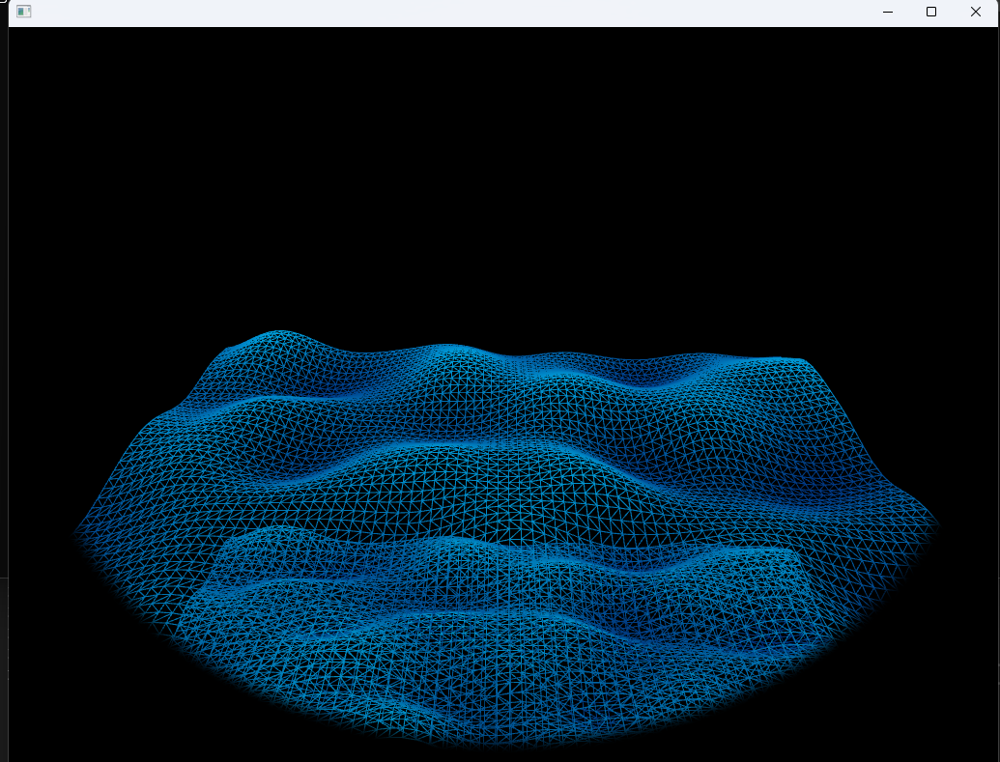

# RETO

## IDEA

La idea es hacer un reto parecido a la modificación del ejemplo 8 que ya hice, quiero hacer una playa pero con un filtro o una mascara para que se vea mas o menos retro:

Basicamente quiero hacer una playa o isla a punta de mallas. no es una idea tan compleja de explicar.

## CONSTRUCCIÓN DE LA ALICACIÓN

### PRIMERA VERSIÓN

Cogemos la modificación del ejemplo 8 que hice anteriormente.

### SEGUNDA VERSIÓN

Le agregue una viñeta como de un lente para que se vea mas bacano en mi opinion, y otra malla de agua para que esta se vea mas llena y no con tantas lineas.

### TERCERA VERSIÓN

