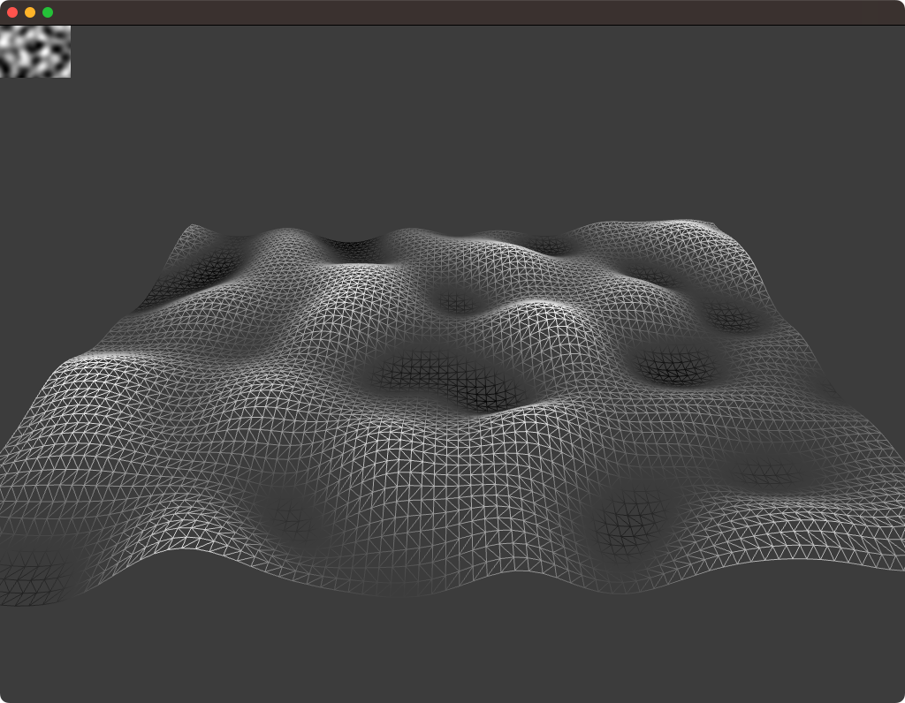
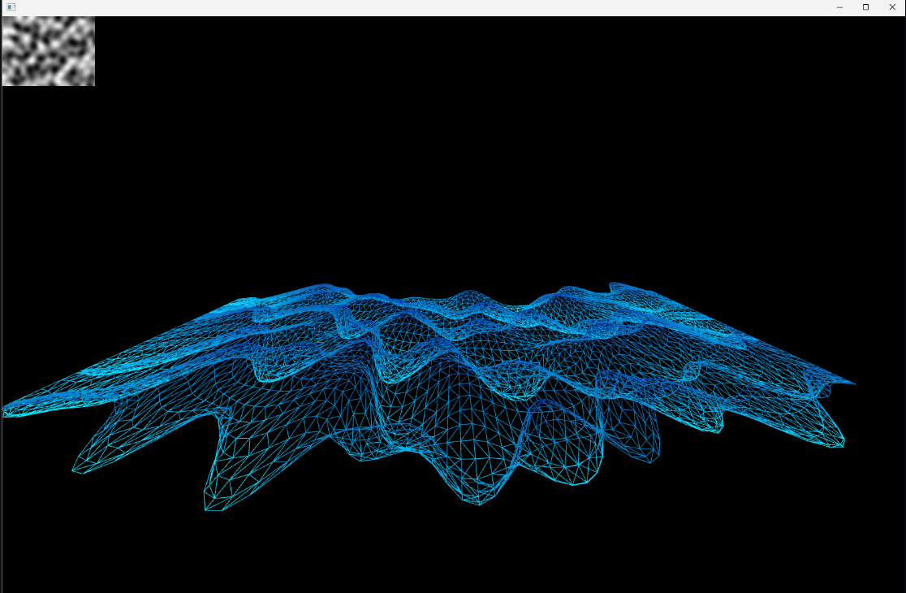
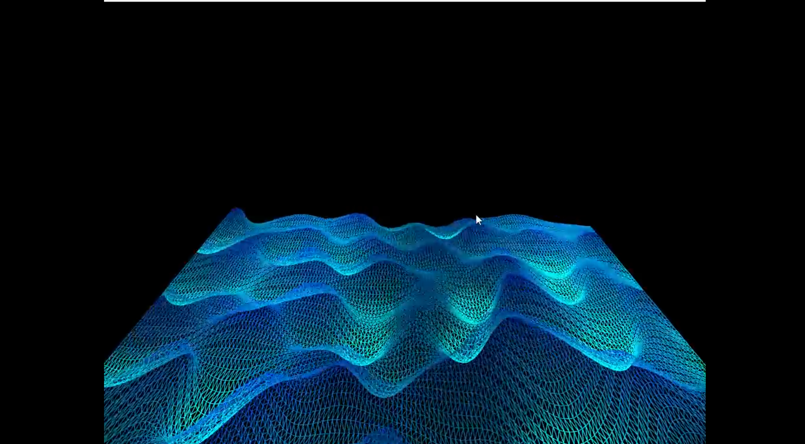

# RETO

## IDEA

La idea es modificar un poco el ejemplo 8, ya que fue el que mas me gusta, y vamos a usar la modificación que le hice para mejorarlo aun mas, la gracia es que las olas sean multicolores y haya una viñeta como si fuera de un telescopio que muestre las olas.

## CONSTRUCCIÓN DE LA APLICACIÓN

### PRIMERA VERSIÓN



Cogi el ejemplo inicial para verlo bien y ver que modificaciones le podia hacer

### SEGUNDA VERSIÓN



Aca fue la modificación que le hice al ejemplo 8 y lo puse en la investigación, cambie el movimiento por ondas senoidales como si fueran de olas con un color bastante azulado-

### TERCERA VERSIÓN (ULTIMA)



Le agregue colores neon y una viñeta que hace ver mas bacana la imagen.


## APLICACIÓN Y FUNCIONAMIENTO

<video controls src="20251103-0437-32.1124584 (1).mp4" title="Title"></video>

Este proyecto muestra una malla plana que se mueve como si fueran olas de agua. Para lograrlo, se usa una textura de ruido que cambia con el tiempo y hace que los puntos de la malla suban y bajen. Esto se hace por las funciones seno.

El shader.vert usa ese ruido para deformar la malla y crear el movimiento de las olas. 

El shader.frag se encarga del color, haciendo que las olas sean multicolor y brillen con un efecto tipo neón. Además, se agrega una viñeta circular que oscurece los bordes para resaltar el centro

### CODIGOS

OFAPP.CPP

```cpp
#include "ofApp.h"

//--------------------------------------------------------------
void ofApp::setup(){
    ofDisableArbTex();
    ofEnableDepthTest();

    if(ofIsGLProgrammableRenderer()){
        shader.load("shadersGL3/shader");
    } else {
        shader.load("shadersGL2/shader");
    }

    img.allocate(100, 100, OF_IMAGE_GRAYSCALE);
    plane.set(800, 600, 150, 100);
    plane.mapTexCoordsFromTexture(img.getTexture());

    ofBackground(0);
}

//--------------------------------------------------------------
void ofApp::update(){
    float noiseScale = 0.05;
    float time = ofGetElapsedTimef() * 0.5;

    ofPixels & pixels = img.getPixels();
    int w = img.getWidth();
    int h = img.getHeight();

    for(int y=0; y<h; y++) {
        for(int x=0; x<w; x++) {
            float noiseValue = ofNoise(x * noiseScale, y * noiseScale, time);
            pixels[y * w + x] = 255 * noiseValue;
        }
    }
    img.update();
}

//--------------------------------------------------------------
void ofApp::draw(){
    ofEnableDepthTest();
    shader.begin();
    shader.setUniformTexture("tex0", img.getTexture(), 0);
    shader.setUniform2f("u_resolution", ofGetWidth(), ofGetHeight());
    shader.setUniform1f("u_time", ofGetElapsedTimef());

    ofPushMatrix();
    ofTranslate(ofGetWidth()/2, ofGetHeight()/2 + 100);
    ofRotateDeg(60, 1, 0, 0);
    plane.drawWireframe();
    ofPopMatrix();

    shader.end();
    ofDisableDepthTest();
}

//--------------------------------------------------------------
void ofApp::keyPressed(int key){}
void ofApp::keyReleased(int key){}
void ofApp::mouseMoved(int x, int y){}
void ofApp::mouseDragged(int x, int y, int button){}
void ofApp::mousePressed(int x, int y, int button){}
void ofApp::mouseReleased(int x, int y, int button){}
void ofApp::windowResized(int w, int h){}
void ofApp::gotMessage(ofMessage msg){}
void ofApp::dragEvent(ofDragInfo dragInfo){}
```

SHADER.VERT

```cpp
#version 150

uniform mat4 modelViewProjectionMatrix;
in vec4 position;
in vec2 texcoord;

uniform sampler2D tex0;

out vec2 vTexCoord;

void main() {
    float scale = 150.0;
    float displacement = texture(tex0, texcoord).r * scale;

    vec4 pos = position;
    pos.y += displacement;
    gl_Position = modelViewProjectionMatrix * pos;

    vTexCoord = texcoord;
}
```

SHADER.FRAG

```cpp
#version 150

uniform sampler2D tex0;
uniform vec2 u_resolution;
uniform float u_time;

in vec2 vTexCoord;
out vec4 outputColor;

void main() {
    float height = texture(tex0, vTexCoord).r;

    vec3 colorA = vec3(0.0, 0.2, 0.8);  
    vec3 colorB = vec3(0.0, 1.0, 1.0);  
    vec3 baseColor = mix(colorA, colorB, height);

    baseColor *= 0.8 + 0.2 * sin(u_time * 2.0 + vTexCoord.x * 10.0);

    float glow = smoothstep(0.6, 0.9, height);
    vec3 neon = mix(baseColor, vec3(0.0, 1.0, 1.0), glow * 0.9);
    
    float pulse = 0.5 + 0.5 * sin(u_time * 4.0);
    neon += pulse * 0.1 * vec3(0.0, 0.8, 1.0);

    vec2 uv = gl_FragCoord.xy / u_resolution;
    vec2 center = vec2(0.5, 0.5);
    float dist = distance(uv, center);
    float vignette = smoothstep(0.55, 0.9, dist);

    vec3 finalColor = neon * (1.0 - vignette);

    outputColor = vec4(finalColor, 1.0);
}
```